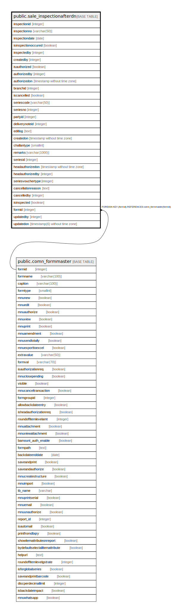

# public.sale_inspectionafterdn

## Description

## Columns

| Name | Type | Default | Nullable | Children | Parents | Comment |
| ---- | ---- | ------- | -------- | -------- | ------- | ------- |
| inspectionid | integer | nextval('sale_inspectionafterdn_inspectionid_seq'::regclass) | false |  |  |  |
| inspectionno | varchar(50) |  | true |  |  |  |
| inspectiondate | date |  | false |  |  |  |
| isinspectionoccured | boolean |  | true |  |  |  |
| inspectedby | integer |  | true |  |  |  |
| createdby | integer |  | true |  |  |  |
| isauthorized | boolean |  | true |  |  |  |
| authorizedby | integer |  | true |  |  |  |
| authorizedon | timestamp without time zone |  | true |  |  |  |
| branchid | integer |  | true |  |  |  |
| iscancelled | boolean |  | true |  |  |  |
| seriescode | varchar(50) |  | true |  |  |  |
| seriesno | integer |  | true |  |  |  |
| partyid | integer |  | true |  |  |  |
| deliverynoteid | integer |  | true |  |  |  |
| editlog | text |  | true |  |  |  |
| createdon | timestamp without time zone | now() | true |  |  |  |
| challantype | smallint |  | true |  |  |  |
| remarks | varchar(1000) |  | true |  |  |  |
| seriesid | integer |  | true |  |  |  |
| headauthorizedon | timestamp without time zone |  | true |  |  |  |
| headauthorizedby | integer |  | true |  |  |  |
| seriesvouchertype | integer | 0 | true |  |  |  |
| cancellationreason | text |  | true |  |  |  |
| cancelledby | integer |  | true |  |  |  |
| isinspected | boolean |  | true |  |  |  |
| formid | integer | 626 | false |  | [public.comn_formmaster](public.comn_formmaster.md) |  |
| updatedby | integer |  | true |  |  |  |
| updatedon | timestamp(6) without time zone | NULL::timestamp without time zone | true |  |  |  |

## Constraints

| Name | Type | Definition |
| ---- | ---- | ---------- |
| sale_inspectionafterdn_formid_fkey | FOREIGN KEY | FOREIGN KEY (formid) REFERENCES comn_formmaster(formid) |
| sale_inspectionafterdn_pkey | PRIMARY KEY | PRIMARY KEY (inspectionid) |

## Indexes

| Name | Definition |
| ---- | ---------- |
| sale_inspectionafterdn_pkey | CREATE UNIQUE INDEX sale_inspectionafterdn_pkey ON public.sale_inspectionafterdn USING btree (inspectionid) |

## Relations

---

> Generated by [tbls](https://github.com/k1LoW/tbls)
