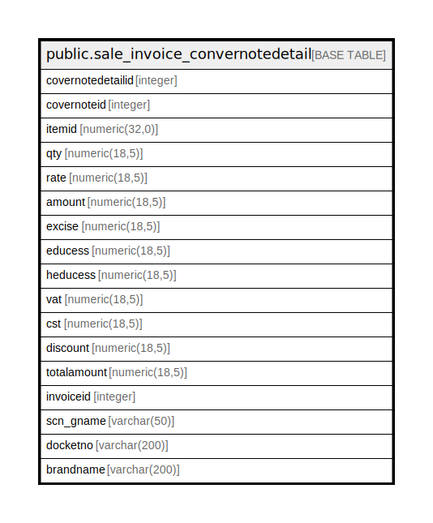

# public.sale_invoice_convernotedetail

## Description

## Columns

| Name | Type | Default | Nullable | Children | Parents | Comment |
| ---- | ---- | ------- | -------- | -------- | ------- | ------- |
| covernotedetailid | integer | nextval('sale_invoice_convernotedetail_covernotedetailid_seq'::regclass) | false |  |  |  |
| covernoteid | integer |  | true |  |  |  |
| itemid | numeric(32,0) |  | true |  |  |  |
| qty | numeric(18,5) |  | true |  |  |  |
| rate | numeric(18,5) |  | true |  |  |  |
| amount | numeric(18,5) |  | true |  |  |  |
| excise | numeric(18,5) |  | true |  |  |  |
| educess | numeric(18,5) |  | true |  |  |  |
| heducess | numeric(18,5) |  | true |  |  |  |
| vat | numeric(18,5) |  | true |  |  |  |
| cst | numeric(18,5) |  | true |  |  |  |
| discount | numeric(18,5) |  | true |  |  |  |
| totalamount | numeric(18,5) |  | true |  |  |  |
| invoiceid | integer |  | true |  |  |  |
| scn_gname | varchar(50) |  | true |  |  |  |
| docketno | varchar(200) |  | true |  |  |  |
| brandname | varchar(200) |  | true |  |  |  |

## Constraints

| Name | Type | Definition |
| ---- | ---- | ---------- |
| sale_invoice_convernotedetail_pkey | PRIMARY KEY | PRIMARY KEY (covernotedetailid) |

## Indexes

| Name | Definition |
| ---- | ---------- |
| sale_invoice_convernotedetail_pkey | CREATE UNIQUE INDEX sale_invoice_convernotedetail_pkey ON public.sale_invoice_convernotedetail USING btree (covernotedetailid) |

## Relations

---

> Generated by [tbls](https://github.com/k1LoW/tbls)
