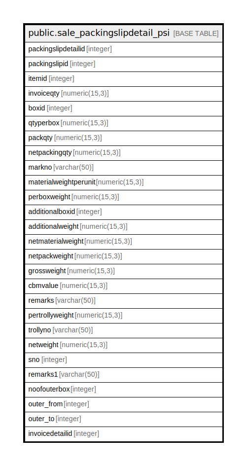

# public.sale_packingslipdetail_psi

## Description

## Columns

| Name | Type | Default | Nullable | Children | Parents | Comment |
| ---- | ---- | ------- | -------- | -------- | ------- | ------- |
| packingslipdetailid | integer | nextval('sale_packingslipdetail_psi_packingslipdetailid_seq'::regclass) | false |  |  |  |
| packingslipid | integer |  | true |  |  |  |
| itemid | integer |  | true |  |  |  |
| invoiceqty | numeric(15,3) |  | true |  |  |  |
| boxid | integer |  | true |  |  |  |
| qtyperbox | numeric(15,3) |  | true |  |  |  |
| packqty | numeric(15,3) |  | true |  |  |  |
| netpackingqty | numeric(15,3) |  | true |  |  |  |
| markno | varchar(50) |  | true |  |  |  |
| materialweightperunit | numeric(15,3) |  | true |  |  |  |
| perboxweight | numeric(15,3) |  | true |  |  |  |
| additionalboxid | integer |  | true |  |  |  |
| additionalweight | numeric(15,3) |  | true |  |  |  |
| netmaterialweight | numeric(15,3) |  | true |  |  |  |
| netpackweight | numeric(15,3) |  | true |  |  |  |
| grossweight | numeric(15,3) |  | true |  |  |  |
| cbmvalue | numeric(15,3) |  | true |  |  |  |
| remarks | varchar(50) |  | true |  |  |  |
| pertrollyweight | numeric(15,3) | 0 | false |  |  |  |
| trollyno | varchar(50) | ''::character varying | false |  |  |  |
| netweight | numeric(15,3) | 0 | false |  |  |  |
| sno | integer | 0 | false |  |  |  |
| remarks1 | varchar(50) | ''::character varying | false |  |  |  |
| noofouterbox | integer | 0 | true |  |  |  |
| outer_from | integer |  | true |  |  |  |
| outer_to | integer |  | true |  |  |  |
| invoicedetailid | integer | 0 | true |  |  |  |

## Constraints

| Name | Type | Definition |
| ---- | ---- | ---------- |
| sale_packingslipdetail_psi_pkey | PRIMARY KEY | PRIMARY KEY (packingslipdetailid) |

## Indexes

| Name | Definition |
| ---- | ---------- |
| sale_packingslipdetail_psi_pkey | CREATE UNIQUE INDEX sale_packingslipdetail_psi_pkey ON public.sale_packingslipdetail_psi USING btree (packingslipdetailid) |
| Index_PS_Det_PSFPSI | CREATE INDEX "Index_PS_Det_PSFPSI" ON public.sale_packingslipdetail_psi USING btree (packingslipid) |

## Relations

---

> Generated by [tbls](https://github.com/k1LoW/tbls)
