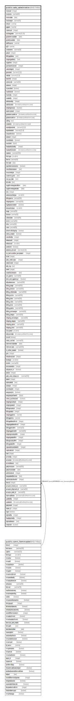

# public.sale_salesinvoice

## Description

## Columns

| Name | Type | Default | Nullable | Children | Parents | Comment |
| ---- | ---- | ------- | -------- | -------- | ------- | ------- |
| invoiceid | integer | nextval('sale_salesinvoice_invoiceid_seq'::regclass) | false |  |  |  |
| invoiceno | varchar(50) |  | true |  |  |  |
| invoicedate | date |  | true |  |  |  |
| invoicetype | varchar(30) |  | true |  |  | Sales Invoice -->0,  Sample Invoice -> 1,  Debit Note -> 2,  Work Order Invoice -> 3,  Supplimentary Invoice -> 4,  Scrape Sales Invoice ->5,  Fixed Sales Invoice ->6,  Domestic Sales Invoice Without SO ->7,  DebitNote Against SalesInvoice ->8,  DebitNote Manualy ->9,  Debit Note Against Inward Challan -->10, Service Sales Invoice(SrvSI) -->11,  Proforma Sales Invoice Against SO (PRFSI) -->12, BOM KIT Invoice -->13 |
| entryno | varchar |  | true |  |  |  |
| pageno | varchar |  | true |  |  |  |
| currencyid | integer |  | true |  |  |  |
| exchangerate | numeric(21,10) |  | true |  |  |  |
| goodsremovaldate | date |  | true |  |  |  |
| goodsissuedate | date |  | true |  |  |  |
| tariffclassno | varchar |  | true |  |  |  |
| rg23 | varchar |  | true |  |  |  |
| containerno | varchar(30) |  | true |  |  |  |
| partyid | integer |  | true |  |  |  |
| billingaddress | text |  | true |  |  |  |
| shippingaddress | text |  | true |  |  |  |
| supplierid | integer |  | true |  |  |  |
| purchaseinvoiceid | integer |  | true |  |  |  |
| salesledgerid | integer |  | true |  |  |  |
| grosstotal | numeric(21,9) |  | true |  |  |  |
| nettotal | numeric(21,9) |  | true |  |  |  |
| branchid | integer |  | true |  |  |  |
| seriescode | varchar(50) |  | true |  |  |  |
| seriesno | integer |  | true |  |  |  |
| iscancelled | boolean | false | true |  |  |  |
| isauthorized | boolean | false | true |  |  |  |
| invoiceby | integer |  | true |  |  |  |
| createdby | integer |  | true |  |  |  |
| authorizedby | integer |  | true |  |  |  |
| authorizedon | timestamp without time zone | now() | true |  |  |  |
| istradinginvoice | boolean | false | false |  |  |  |
| taxtemplateid | integer |  | true |  |  |  |
| goodsremovaltime | timestamp without time zone |  | true |  |  |  |
| goodsissuetime | timestamp without time zone |  | true |  |  |  |
| editlog | text |  | true |  |  |  |
| createdon | timestamp without time zone | now() | true |  |  |  |
| exportgrosstotal | numeric(21,9) | NULL::numeric | true |  |  |  |
| exportnettotal | numeric(21,9) | NULL::numeric | true |  |  |  |
| isexportinvoice | boolean | false | true |  |  |  |
| seriesid | integer |  | true |  |  |  |
| issendtotally | boolean | false | true |  |  |  |
| voucherid | bigint |  | true |  |  |  |
| headauthorizedby | integer |  | true |  |  |  |
| headauthorizedon | timestamp without time zone |  | true |  |  |  |
| narration | varchar(1000) | ''::character varying | true |  |  |  |
| formtype | smallint |  | true |  |  |  |
| formno | varchar(20) | NULL::character varying | true |  |  |  |
| formdate | date |  | true |  |  |  |
| isprintitemrevisionno | boolean | false | true |  |  |  |
| cancellationreason | text |  | true |  |  |  |
| sivouchertype | integer |  | true |  |  |  |
| customer_pono | text |  | true |  |  |  |
| cust_po_date | text |  | true |  |  |  |
| remarks | text |  | true |  |  |  |
| supplimentaryperiodfrom | date |  | true |  |  |  |
| supplimentaryperiodto | date |  | true |  |  |  |
| srno | integer |  | true |  |  |  |
| seriesvouchertype | smallint | 0 | true |  |  |  |
| billingname | varchar(200) |  | true |  |  |  |
| shippingname | varchar(200) |  | true |  |  |  |
| isgatepasscreated | boolean | false | true |  |  |  |
| transactiontype | smallint | 0 | true |  |  | 0-On Credit (Udhar), 1-Cash Transaction |
| range | varchar(50) |  | true |  |  |  |
| division | varchar(50) |  | true |  |  |  |
| collectorate | varchar(50) |  | true |  |  |  |
| eccno | varchar(50) |  | true |  |  |  |
| lstno | varchar(50) |  | true |  |  |  |
| cstno | varchar(50) |  | true |  |  |  |
| allowmultishipping | boolean | false | true |  |  |  |
| online_created | boolean | false | true |  |  |  |
| cancelledby | integer |  | true |  |  |  |
| referenceid | integer |  | true |  |  |  |
| referenceof | smallint |  | true |  |  | 0->Sales Invoice 1->Inward Challan |
| sentincrm | boolean | false | true |  |  |  |
| advance_amount | numeric(21,9) | 0 | true |  |  |  |
| inv_termcondition_templateid | integer | 0 | true |  |  |  |
| scnid | integer |  | true |  |  |  |
| party_credit_days | integer | 0 | true |  |  |  |
| salesmanid | integer |  | true |  |  | Employee id as a sales person |
| tally_log | text | ''::text | true |  |  |  |
| siteid | integer |  | true |  |  |  |
| unauthorizereason | text |  | true |  |  |  |
| scn_gname | varchar(50) |  | true |  |  |  |
| dncn_amt_against_pi | boolean | false | true |  |  |  |
| tallyreferenceno | varchar(200) |  | true |  |  |  |
| billing_range | varchar(500) |  | true |  |  |  |
| billing_division | varchar(500) |  | true |  |  |  |
| billing_collectorate | varchar(500) |  | true |  |  |  |
| billing_eccno | varchar(500) |  | true |  |  |  |
| billing_lstno | varchar(500) |  | true |  |  |  |
| billing_cstno | varchar(500) |  | true |  |  |  |
| billing_tinno | varchar(500) |  | true |  |  |  |
| billing_panno | varchar(500) |  | true |  |  |  |
| billing_exciseregno | varchar(50) |  | true |  |  |  |
| billing_stregno | varchar(50) |  | true |  |  |  |
| shipping_exciseregno | varchar(50) |  | true |  |  |  |
| shipping_stregno | varchar(50) |  | true |  |  |  |
| shipping_panno | varchar(50) |  | true |  |  |  |
| shipping_tinno | varchar(50) |  | true |  |  |  |
| isimported | smallint | 0 | true |  |  | 0 -> Normal SI 1 -> Imported From Excel [Data Wind] 2 -> Imported From Webportal [Data Wind] |
| tallysyncdate | timestamp without time zone |  | true |  |  |  |
| ismidr | boolean |  | true |  |  |  |
| series_number | varchar(50) |  | true |  |  |  |
| cformreminderdate | date |  | true |  |  |  |
| cformremarks | varchar(5000) |  | true |  |  |  |
| is_online_created | boolean |  | true |  |  |  |
| grno | integer |  | true |  |  |  |
| linkedinvoiceid | integer |  | true |  |  |  |
| bondtype | smallint | '-1'::integer | true |  |  |  |
| bondno | varchar(50) |  | true |  |  |  |
| exciseserialno | integer |  | true |  |  |  |
| adcpasson_m | boolean | true | true |  |  |  |
| are1no | integer |  | true |  |  |  |
| party_wise_unique_no | varchar(200) |  | true |  |  |  |
| alterid | integer |  | true |  |  |  |
| awbnodetail | text |  | true |  |  |  |
| autorgno | integer |  | true |  |  |  |
| excisetypeid | integer |  | true |  |  |  |
| easypossync | boolean | false | true |  |  |  |
| easypospurchaseid | bigint |  | true |  |  |  |
| online_synchronized | boolean | false | true |  |  |  |
| shippingcountryid | integer |  | true |  |  |  |
| shippingstateid | integer |  | true |  |  |  |
| billingcountryid | integer |  | true |  |  |  |
| billingstateid | integer |  | true |  |  |  |
| shippinggstinno | varchar |  | true |  |  |  |
| billinggstinno | varchar |  | true |  |  |  |
| billingaddressfrmid | integer |  | true |  |  |  |
| shippingaddressfrmid | integer |  | true |  |  |  |
| billinggstinnofrm | varchar(50) |  | true |  |  |  |
| shippinggstinnofrm | varchar(50) |  | true |  |  |  |
| shippingcountryidfrm | integer |  | true |  |  |  |
| shippingstateidfrm | integer |  | true |  |  |  |
| billingcountryidfrm | integer |  | true |  |  |  |
| billingstateidfrm | integer |  | true |  |  |  |
| sapwarehousedetailid | integer | 0 | false |  |  |  |
| saplocationid | integer | 0 | false |  |  |  |
| lutid | integer |  | true |  |  |  |
| amendby | integer |  | true |  |  |  |
| amendon | timestamp(6) without time zone | NULL::timestamp without time zone | true |  |  |  |
| amendreason | text |  | true |  |  |  |
| partyinvoiceno | varchar(500) |  | true |  |  |  |
| partyinvoicedate | date |  | true |  |  |  |
| authorizelevel | integer | 0 | true |  |  |  |
| lastupdatedformula | text |  | true |  |  |  |
| authorizationlevelid | integer | 0 | true |  |  |  |
| formid | integer | 76 | false |  | [public.comn_formmaster](public.comn_formmaster.md) |  |
| amazon_invoice_no | varchar(50) | ''::character varying | true |  |  |  |
| amazon_shipment_id | varchar(50) | ''::character varying | true |  |  |  |
| amazon_order_id | varchar(50) |  | true |  |  |  |
| lastmodifiedon | timestamp(6) without time zone | now() | true |  |  |  |
| updatedby | integer |  | true |  |  |  |
| updatedon | timestamp(6) without time zone | NULL::timestamp without time zone | true |  |  |  |
| partysiteid | integer | 0 | true |  |  |  |
| dealer_id | integer | 0 | true |  |  |  |
| isgst | boolean | false | true |  |  |  |
| rejectedby | integer |  | true |  |  |  |
| headrejectedby | integer |  | true |  |  |  |
| rejectedreason | text |  | true |  |  |  |
| isrejected | boolean |  | true |  |  |  |

## Constraints

| Name | Type | Definition |
| ---- | ---- | ---------- |
| sale_salesinvoice_formid_fkey | FOREIGN KEY | FOREIGN KEY (formid) REFERENCES comn_formmaster(formid) |
| pwun | UNIQUE | UNIQUE (partyid, party_wise_unique_no, branchid, iscancelled) |
| sale_salesinvoice_pkey | PRIMARY KEY | PRIMARY KEY (invoiceid) |

## Indexes

| Name | Definition |
| ---- | ---------- |
| pwun | CREATE UNIQUE INDEX pwun ON public.sale_salesinvoice USING btree (partyid, party_wise_unique_no, branchid, iscancelled) |
| sale_salesinvoice_pkey | CREATE UNIQUE INDEX sale_salesinvoice_pkey ON public.sale_salesinvoice USING btree (invoiceid) |
| Index_SI_SalesRegister | CREATE INDEX "Index_SI_SalesRegister" ON public.sale_salesinvoice USING btree (invoiceid, invoicedate) WHERE ((isauthorized = true) AND (iscancelled = false) AND (istradinginvoice = false) AND (branchid = 1) AND ((invoicetype)::text = ANY (ARRAY[('0'::character varying)::text, ('1'::character varying)::text, ('2'::character varying)::text, ('3'::character varying)::text, ('4'::character varying)::text, ('5'::character varying)::text, ('6'::character varying)::text, ('7'::character varying)::text, ('11'::character varying)::text]))) |
| ui_salesinvoice_invoiceno | CREATE UNIQUE INDEX ui_salesinvoice_invoiceno ON public.sale_salesinvoice USING btree (branchid, invoicetype, invoicedate, invoiceno, seriesvouchertype) WHERE (invoiceid > 0) |

## Triggers

| Name | Definition |
| ---- | ---------- |
| exciseserialno | CREATE TRIGGER exciseserialno AFTER INSERT ON public.sale_salesinvoice FOR EACH ROW EXECUTE FUNCTION trg_generate_exciseserialno() |
| tgr_gstr_validate | CREATE TRIGGER tgr_gstr_validate AFTER INSERT OR DELETE OR UPDATE ON public.sale_salesinvoice FOR EACH ROW EXECUTE FUNCTION fun_tgr_gstr_validate() |
| update_alter_id | CREATE TRIGGER update_alter_id AFTER INSERT OR UPDATE ON public.sale_salesinvoice FOR EACH ROW EXECUTE FUNCTION updatealterid() |

## Relations

---

> Generated by [tbls](https://github.com/k1LoW/tbls)
