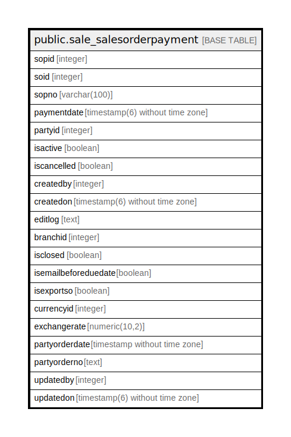

# public.sale_salesorderpayment

## Description

## Columns

| Name | Type | Default | Nullable | Children | Parents | Comment |
| ---- | ---- | ------- | -------- | -------- | ------- | ------- |
| sopid | integer | nextval('sale_salesorderpayment_sopid_seq'::regclass) | false |  |  |  |
| soid | integer |  | true |  |  |  |
| sopno | varchar(100) |  | true |  |  |  |
| paymentdate | timestamp(6) without time zone |  | true |  |  |  |
| partyid | integer |  | true |  |  |  |
| isactive | boolean |  | true |  |  |  |
| iscancelled | boolean |  | true |  |  |  |
| createdby | integer |  | true |  |  |  |
| createdon | timestamp(6) without time zone | now() | true |  |  |  |
| editlog | text |  | true |  |  |  |
| branchid | integer |  | true |  |  |  |
| isclosed | boolean | false | true |  |  |  |
| isemailbeforeduedate | boolean | false | true |  |  |  |
| isexportso | boolean |  | true |  |  |  |
| currencyid | integer |  | true |  |  |  |
| exchangerate | numeric(10,2) |  | true |  |  |  |
| partyorderdate | timestamp without time zone |  | true |  |  |  |
| partyorderno | text |  | true |  |  |  |
| updatedby | integer |  | true |  |  |  |
| updatedon | timestamp(6) without time zone | NULL::timestamp without time zone | true |  |  |  |

## Constraints

| Name | Type | Definition |
| ---- | ---- | ---------- |
| salesorderpayment_key | PRIMARY KEY | PRIMARY KEY (sopid) |

## Indexes

| Name | Definition |
| ---- | ---------- |
| salesorderpayment_key | CREATE UNIQUE INDEX salesorderpayment_key ON public.sale_salesorderpayment USING btree (sopid) |

## Relations

---

> Generated by [tbls](https://github.com/k1LoW/tbls)
