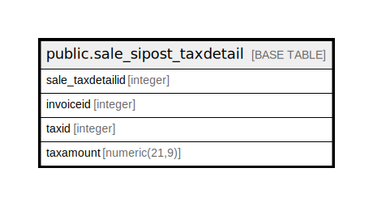

# public.sale_sipost_taxdetail

## Description

## Columns

| Name | Type | Default | Nullable | Children | Parents | Comment |
| ---- | ---- | ------- | -------- | -------- | ------- | ------- |
| sale_taxdetailid | integer | nextval('sale_sipost_taxdetail_sale_taxdetailid_seq'::regclass) | false |  |  |  |
| invoiceid | integer |  | true |  |  |  |
| taxid | integer |  | true |  |  |  |
| taxamount | numeric(21,9) |  | true |  |  |  |

## Constraints

| Name | Type | Definition |
| ---- | ---- | ---------- |
| sale_post_taxdetail_pkey | PRIMARY KEY | PRIMARY KEY (sale_taxdetailid) |

## Indexes

| Name | Definition |
| ---- | ---------- |
| sale_post_taxdetail_pkey | CREATE UNIQUE INDEX sale_post_taxdetail_pkey ON public.sale_sipost_taxdetail USING btree (sale_taxdetailid) |
| Index_SalePostTax_InvId | CREATE INDEX "Index_SalePostTax_InvId" ON public.sale_sipost_taxdetail USING btree (invoiceid) |

## Relations

---

> Generated by [tbls](https://github.com/k1LoW/tbls)
