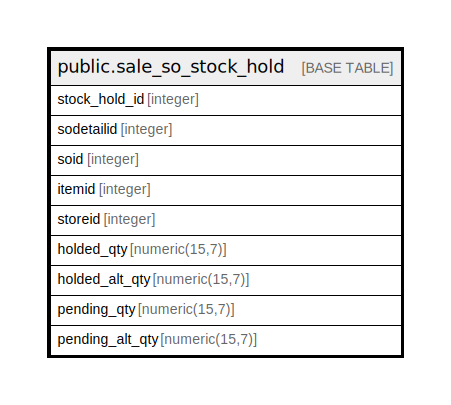

# public.sale_so_stock_hold

## Description

## Columns

| Name | Type | Default | Nullable | Children | Parents | Comment |
| ---- | ---- | ------- | -------- | -------- | ------- | ------- |
| stock_hold_id | integer | nextval('sale_so_stock_hold_stock_hold_id_seq'::regclass) | false |  |  |  |
| sodetailid | integer |  | false |  |  |  |
| soid | integer |  | false |  |  |  |
| itemid | integer |  | false |  |  |  |
| storeid | integer |  | false |  |  |  |
| holded_qty | numeric(15,7) |  | false |  |  |  |
| holded_alt_qty | numeric(15,7) |  | true |  |  |  |
| pending_qty | numeric(15,7) |  | false |  |  |  |
| pending_alt_qty | numeric(15,7) |  | true |  |  |  |

## Constraints

| Name | Type | Definition |
| ---- | ---- | ---------- |
| sale_so_stock_hold_pkey | PRIMARY KEY | PRIMARY KEY (stock_hold_id) |

## Indexes

| Name | Definition |
| ---- | ---------- |
| sale_so_stock_hold_pkey | CREATE UNIQUE INDEX sale_so_stock_hold_pkey ON public.sale_so_stock_hold USING btree (stock_hold_id) |
| Index_SO_HolDet_SOID | CREATE INDEX "Index_SO_HolDet_SOID" ON public.sale_so_stock_hold USING btree (soid) |

## Relations

---

> Generated by [tbls](https://github.com/k1LoW/tbls)
