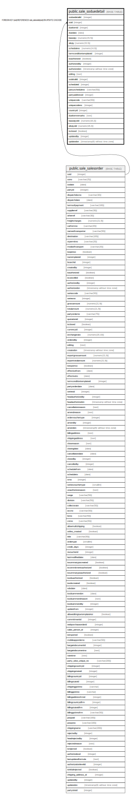

# public.sale_soduedetail

## Description

## Columns

| Name | Type | Default | Nullable | Children | Parents | Comment |
| ---- | ---- | ------- | -------- | -------- | ------- | ------- |
| soduedetailid | integer | nextval('sale_soduedetail_soduedetailid_seq'::regclass) | false |  |  |  |
| soid | integer |  | true |  | [public.sale_salesorder](public.sale_salesorder.md) |  |
| dueitemid | integer |  | true |  |  |  |
| duedate | date |  | true |  |  |  |
| baseqty | numeric(15,5) |  | true |  |  |  |
| altqty | numeric(15,5) |  | true |  |  |  |
| scheduleno | numeric(14,0) |  | true |  |  |  |
| termconditiontemplateid | integer |  | true |  |  |  |
| isauthorized | boolean | false | true |  |  |  |
| authorizedby | integer |  | true |  |  |  |
| authorizedon | timestamp without time zone |  | true |  |  |  |
| editlog | text |  | true |  |  |  |
| sodetailid | integer |  | true |  |  |  |
| scheduleid | integer |  | true |  |  |  |
| partyscheduleno | varchar(50) |  | true |  |  |  |
| partyaddressid | integer |  | true |  |  |  |
| uniquecode | varchar(50) |  | true |  |  |  |
| uniquecodeno | integer |  | true |  |  |  |
| countryid | integer | 0 | true |  |  |  |
| dueitemremarks | text |  | true |  |  |  |
| baseqtyold | numeric(18,2) |  | true |  |  |  |
| altqtyold | numeric(18,2) |  | true |  |  |  |
| isclosed | boolean | false | true |  |  |  |
| updatedby | integer |  | true |  |  |  |
| updatedon | timestamp(6) without time zone | NULL::timestamp without time zone | true |  |  |  |

## Constraints

| Name | Type | Definition |
| ---- | ---- | ---------- |
| soduedetail_fk | FOREIGN KEY | FOREIGN KEY (soid) REFERENCES sale_salesorder(soid) ON UPDATE CASCADE |
| soduedetail_pkey | PRIMARY KEY | PRIMARY KEY (soduedetailid) |
| uc | UNIQUE | UNIQUE (uniquecode) |
| ucn | UNIQUE | UNIQUE (uniquecodeno) |

## Indexes

| Name | Definition |
| ---- | ---------- |
| soduedetail_pkey | CREATE UNIQUE INDEX soduedetail_pkey ON public.sale_soduedetail USING btree (soduedetailid) |
| uc | CREATE UNIQUE INDEX uc ON public.sale_soduedetail USING btree (uniquecode) |
| ucn | CREATE UNIQUE INDEX ucn ON public.sale_soduedetail USING btree (uniquecodeno) |
| Index_SO_DueDet_DetID | CREATE INDEX "Index_SO_DueDet_DetID" ON public.sale_soduedetail USING btree (sodetailid) |
| Index_SO_DueDet_SOIDDetID | CREATE INDEX "Index_SO_DueDet_SOIDDetID" ON public.sale_soduedetail USING btree (soid, sodetailid) |

## Triggers

| Name | Definition |
| ---- | ---------- |
| so_amend_log_entry | CREATE TRIGGER so_amend_log_entry AFTER UPDATE ON public.sale_soduedetail FOR EACH ROW EXECUTE FUNCTION so_amend_log_entry() |

## Relations

---

> Generated by [tbls](https://github.com/k1LoW/tbls)
