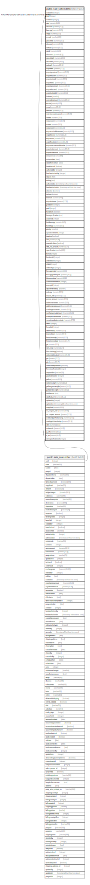

# public.sale_soitemdetail

## Description

## Columns

| Name | Type | Default | Nullable | Children | Parents | Comment |
| ---- | ---- | ------- | -------- | -------- | ------- | ------- |
| sodetailid | integer | nextval('sale_soitemdetail_sodetailid_seq'::regclass) | false |  |  |  |
| soid | integer |  | true |  | [public.sale_salesorder](public.sale_salesorder.md) |  |
| soitemid | integer |  | true |  |  |  |
| rate | numeric(15,5) |  | true |  |  |  |
| discount | numeric(15,5) | 0 | true |  |  |  |
| baseqty | numeric(20,5) |  | true |  |  |  |
| altqty | numeric(20,5) |  | true |  |  |  |
| remark | varchar(500) | NULL::character varying | true |  |  |  |
| grosstotal | numeric(20,5) | 0 | true |  |  |  |
| discamt | numeric(20,5) | 0 | true |  |  |  |
| nettotal | numeric(20,5) | 0 | true |  |  |  |
| rate1 | numeric(15,5) | 0 | true |  |  |  |
| discount1 | numeric(8,5) | 0 | true |  |  |  |
| grosstotal1 | numeric(20,5) | 0 | true |  |  |  |
| discamt1 | numeric(20,5) | 0 | true |  |  |  |
| nettotal1 | numeric(20,5) | 0 | true |  |  |  |
| exportrate | numeric(15,5) | 0 | true |  |  |  |
| exportgrosstotal | numeric(20,5) | 0 | true |  |  |  |
| exportdiscamt | numeric(20,5) | 0 | true |  |  |  |
| exportnettotal | numeric(20,5) | 0 | true |  |  |  |
| exportrate1 | numeric(20,5) | 0 | true |  |  |  |
| exportgrosstotal1 | numeric(20,5) | 0 | true |  |  |  |
| exportdiscamt1 | numeric(20,5) | 0 | true |  |  |  |
| exportnettotal1 | numeric(20,5) | 0 | true |  |  |  |
| isaltrate | smallint |  | true |  |  |  |
| excisableamount | numeric(20,5) | 0 | true |  |  |  |
| excise | numeric(15,5) | 0 | true |  |  |  |
| cess | numeric(15,5) | 0 | true |  |  |  |
| hedcess | numeric(15,5) | 0 | true |  |  |  |
| vatcstasseablevalue | numeric(15,5) | 0 | true |  |  |  |
| vatrate | numeric(15,5) | 0 | true |  |  |  |
| vatamount | numeric(15,5) | 0 | true |  |  |  |
| cstrate | numeric(15,5) | 0 | true |  |  |  |
| cstamount | numeric(15,5) | 0 | true |  |  |  |
| exportexcisableamount | numeric(15,2) | 0 | true |  |  |  |
| exportexcise | numeric(15,2) | 0 | true |  |  |  |
| exportcess | numeric(15,2) | 0 | true |  |  |  |
| exporthedcess | numeric(15,2) | 0 | true |  |  |  |
| exportvatcstasseablevalue | numeric(20,5) | 0 | true |  |  |  |
| exportvatamount | numeric(15,2) | 0 | true |  |  |  |
| exportcstamount | numeric(15,2) | 0 | true |  |  |  |
| revisionno | varchar(30) |  | true |  |  |  |
| revisiondate | date |  | true |  |  |  |
| rateeffectivefrom | date |  | true |  |  |  |
| isauthorized | boolean |  | true |  |  |  |
| authorizedby | integer |  | true |  |  |  |
| headauthorizedby | integer |  | true |  |  |  |
| reason | text |  | true |  |  |  |
| editlog | text |  | true |  |  |  |
| authorizedon | timestamp without time zone |  | true |  |  |  |
| headauthorizedon | timestamp without time zone |  | true |  |  |  |
| deactive | boolean | false | true |  |  |  |
| isclose | boolean | false | true |  |  |  |
| tolamort | numeric(17,5) | 0 | true |  |  | Tools Amortization |
| exporttolamort | numeric(17,5) | 0 | true |  |  | Export Tools Amortization |
| podetailid | integer |  | true |  |  | For Automatic Create PO to SO Linkup |
| poid | integer |  | true |  |  | For Automatic Create PO to SO Linkup |
| holdstock | boolean | false | true |  |  |  |
| itemspecification | text |  | true |  |  |  |
| sostoreid | integer |  | true |  |  |  |
| holdbaseqty | numeric(20,5) |  | true |  |  |  |
| holdaltqty | numeric(20,5) |  | true |  |  |  |
| priority | smallint | 3 | true |  |  | 1--Most Urgent 2--Urgent 3--General |
| quotationdetailid | integer |  | true |  |  |  |
| isactive | boolean | false | true |  |  |  |
| adc | numeric(21,9) |  | true |  |  |  |
| newaddeditem | boolean | true | true |  |  |  |
| rate_incl_excise | numeric(15,7) |  | true |  |  |  |
| spacification | varchar(500) |  | true |  |  |  |
| bomid | integer |  | true |  |  |  |
| bomitemid | integer |  | true |  |  |  |
| slabdetailid | integer |  | true |  |  |  |
| slabid | integer |  | true |  |  |  |
| slabcoltype | integer |  | true |  |  |  |
| focsupplyrate | numeric(18,5) | 0 | true |  |  |  |
| focsupplyrateexport | numeric(18,5) | 0 | true |  |  |  |
| toleranceplus | numeric(10,2) |  | true |  |  |  |
| commitmentdetailid | integer |  | true |  |  |  |
| countryid | integer |  | true |  |  |  |
| qtynotmandatory | boolean |  | true |  |  |  |
| orderqty | numeric(20,5) |  | true |  |  |  |
| excise_rate | numeric(17,5) | NULL::numeric | true |  |  | For Item Excise Ledger |
| excise_amount | numeric(17,5) | NULL::numeric | true |  |  | For Item Excise Ledger |
| additionalvatrate | numeric(21,9) | 0 | true |  |  |  |
| additionalvatamount | numeric(21,9) | 0 | true |  |  |  |
| surchargeonvatrate | numeric(21,9) | 0 | true |  |  |  |
| surchargeonvatamount | numeric(21,9) | 0 | true |  |  |  |
| somrplessabatement | numeric(17,5) | 0 | true |  |  |  |
| somrplessabatementrate | numeric(17,5) | 0 | true |  |  |  |
| rateid | integer | 0 | true |  |  |  |
| formulaid | integer | 0 | true |  |  |  |
| ratewithtax1 | numeric(15,7) |  | true |  |  |  |
| totalwithtax1 | numeric(15,7) |  | true |  |  |  |
| freeschemeqty | numeric(17,7) |  | true |  |  |  |
| freeschemealtqty | numeric(17,7) |  | true |  |  |  |
| ptr | numeric(15,7) |  | true |  |  |  |
| item_mrp | numeric(15,7) |  | true |  |  |  |
| isinclusiveqty | boolean | false | true |  |  |  |
| gstasseablevalue | numeric(21,9) |  | true |  |  |  |
| pts | numeric(15,7) |  | true |  |  |  |
| ptp | numeric(15,7) |  | true |  |  |  |
| isdiscountbyamount | boolean | false | true |  |  |  |
| hsnclassificationid | integer |  | true |  |  |  |
| sapserialno | varchar(20) |  | true |  |  |  |
| gradeattributeid | integer | 0 | false |  |  |  |
| pallets | numeric(10,2) |  | true |  |  |  |
| netitemweight | numeric(10,2) |  | true |  |  |  |
| pallategrossweight | numeric(10,2) |  | true |  |  |  |
| pallatenetweight | numeric(10,2) |  | true |  |  |  |
| unitformula | text | ''::text | true |  |  |  |
| ratethirdunit | numeric(15,5) |  | true |  |  |  |
| updatedby | integer |  | true |  |  |  |
| updatedon | timestamp(6) without time zone | NULL::timestamp without time zone | true |  |  |  |
| soqtylimit | numeric(20,5) |  | true |  |  |  |
| so_coupan_rate | numeric(17,5) | 0 | true |  |  |  |
| so_coupan_amount | numeric(17,5) | 0 | true |  |  |  |
| sobaseqtybeforeclosing | numeric(17,5) | 0 | true |  |  |  |
| soaltqtybeforeclosing | numeric(17,5) | 0 | true |  |  |  |
| cbm | numeric(10,5) |  | true |  |  |  |
| volumetric | numeric(10,5) |  | true |  |  |  |
| g_wt | numeric(10,5) |  | true |  |  |  |
| n_wt | numeric(10,5) |  | true |  |  |  |
| itemspecificationid | integer |  | true |  |  |  |

## Constraints

| Name | Type | Definition |
| ---- | ---- | ---------- |
| Const_PreventDuplicateItemso | UNIQUE | UNIQUE (soid, soitemid, remark) |
| soitemdetail_fk | FOREIGN KEY | FOREIGN KEY (soid) REFERENCES sale_salesorder(soid) ON UPDATE CASCADE |
| soitemdetail_pkey | PRIMARY KEY | PRIMARY KEY (sodetailid) |

## Indexes

| Name | Definition |
| ---- | ---------- |
| Const_PreventDuplicateItemso | CREATE UNIQUE INDEX "Const_PreventDuplicateItemso" ON public.sale_soitemdetail USING btree (soid, soitemid, remark) |
| soitemdetail_pkey | CREATE UNIQUE INDEX soitemdetail_pkey ON public.sale_soitemdetail USING btree (sodetailid) |
| Index_SOItem_SOid | CREATE INDEX "Index_SOItem_SOid" ON public.sale_soitemdetail USING btree (soid) |
| Index_SO_Det_SOID | CREATE INDEX "Index_SO_Det_SOID" ON public.sale_soitemdetail USING btree (soid) |

## Relations

---

> Generated by [tbls](https://github.com/k1LoW/tbls)
