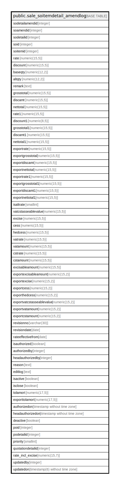

# public.sale_soitemdetail_amendlog

## Description

## Columns

| Name | Type | Default | Nullable | Children | Parents | Comment |
| ---- | ---- | ------- | -------- | -------- | ------- | ------- |
| sodetailamendid | integer | nextval('sale_soitemdetail_amendlog_sodetailamendid_seq'::regclass) | false |  |  |  |
| soamendid | integer |  | true |  |  |  |
| sodetailid | integer |  | true |  |  |  |
| soid | integer |  | true |  |  |  |
| soitemid | integer |  | true |  |  |  |
| rate | numeric(15,5) |  | true |  |  |  |
| discount | numeric(15,5) |  | true |  |  |  |
| baseqty | numeric(12,2) |  | true |  |  |  |
| altqty | numeric(12,2) |  | true |  |  |  |
| remark | text | NULL::character varying | true |  |  |  |
| grosstotal | numeric(15,5) | 0 | true |  |  |  |
| discamt | numeric(15,5) | 0 | true |  |  |  |
| nettotal | numeric(15,5) | 0 | true |  |  |  |
| rate1 | numeric(15,5) | 0 | true |  |  |  |
| discount1 | numeric(8,5) | 0 | true |  |  |  |
| grosstotal1 | numeric(15,5) | 0 | true |  |  |  |
| discamt1 | numeric(15,5) | 0 | true |  |  |  |
| nettotal1 | numeric(15,5) | 0 | true |  |  |  |
| exportrate | numeric(15,5) | 0 | true |  |  |  |
| exportgrosstotal | numeric(15,5) | 0 | true |  |  |  |
| exportdiscamt | numeric(15,5) | 0 | true |  |  |  |
| exportnettotal | numeric(15,5) | 0 | true |  |  |  |
| exportrate1 | numeric(15,5) | 0 | true |  |  |  |
| exportgrosstotal1 | numeric(15,5) | 0 | true |  |  |  |
| exportdiscamt1 | numeric(15,5) | 0 | true |  |  |  |
| exportnettotal1 | numeric(15,5) | 0 | true |  |  |  |
| isaltrate | smallint |  | true |  |  |  |
| vatcstasseablevalue | numeric(15,5) | 0 | true |  |  |  |
| excise | numeric(15,5) | 0 | true |  |  |  |
| cess | numeric(15,5) | 0 | true |  |  |  |
| hedcess | numeric(15,5) | 0 | true |  |  |  |
| vatrate | numeric(15,5) | 0 | true |  |  |  |
| vatamount | numeric(15,5) | 0 | true |  |  |  |
| cstrate | numeric(15,5) | 0 | true |  |  |  |
| cstamount | numeric(15,5) | 0 | true |  |  |  |
| excisableamount | numeric(15,5) | 0 | true |  |  |  |
| exportexcisableamount | numeric(15,2) | 0 | true |  |  |  |
| exportexcise | numeric(15,2) | 0 | true |  |  |  |
| exportcess | numeric(15,2) | 0 | true |  |  |  |
| exporthedcess | numeric(15,2) | 0 | true |  |  |  |
| exportvatcstasseablevalue | numeric(15,2) | 0 | true |  |  |  |
| exportvatamount | numeric(15,2) | 0 | true |  |  |  |
| exportcstamount | numeric(15,2) | 0 | true |  |  |  |
| revisionno | varchar(30) |  | true |  |  |  |
| revisiondate | date |  | true |  |  |  |
| rateeffectivefrom | date |  | true |  |  |  |
| isauthorized | boolean |  | true |  |  |  |
| authorizedby | integer |  | true |  |  |  |
| headauthorizedby | integer |  | true |  |  |  |
| reason | text |  | true |  |  |  |
| editlog | text |  | true |  |  |  |
| isactive | boolean | false | true |  |  |  |
| isclose | boolean | false | true |  |  |  |
| tolamort | numeric(17,5) | 0 | true |  |  | Tools Amortization |
| exporttolamort | numeric(17,5) | 0 | true |  |  | Export Tools Amortization |
| authorizedon | timestamp without time zone |  | true |  |  |  |
| headauthorizedon | timestamp without time zone |  | true |  |  |  |
| deactive | boolean |  | true |  |  |  |
| poid | integer |  | true |  |  |  |
| podetailid | integer |  | true |  |  |  |
| priority | smallint | 3 | true |  |  |  |
| quotationdetailid | integer |  | true |  |  |  |
| rate_incl_excise | numeric(15,7) | 0 | true |  |  |  |
| updatedby | integer |  | true |  |  |  |
| updatedon | timestamp(6) without time zone | NULL::timestamp without time zone | true |  |  |  |

## Constraints

| Name | Type | Definition |
| ---- | ---- | ---------- |
| sale_soitemdetail_amendlog_pkey | PRIMARY KEY | PRIMARY KEY (sodetailamendid) |

## Indexes

| Name | Definition |
| ---- | ---------- |
| sale_soitemdetail_amendlog_pkey | CREATE UNIQUE INDEX sale_soitemdetail_amendlog_pkey ON public.sale_soitemdetail_amendlog USING btree (sodetailamendid) |

## Relations

---

> Generated by [tbls](https://github.com/k1LoW/tbls)
