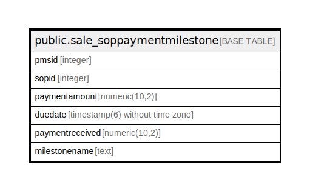

# public.sale_soppaymentmilestone

## Description

## Columns

| Name | Type | Default | Nullable | Children | Parents | Comment |
| ---- | ---- | ------- | -------- | -------- | ------- | ------- |
| pmsid | integer | nextval('sale_soppaymentmilestone_pmsid_seq'::regclass) | false |  |  |  |
| sopid | integer |  | true |  |  |  |
| paymentamount | numeric(10,2) |  | true |  |  |  |
| duedate | timestamp(6) without time zone |  | true |  |  |  |
| paymentreceived | numeric(10,2) |  | true |  |  |  |
| milestonename | text |  | true |  |  |  |

## Constraints

| Name | Type | Definition |
| ---- | ---- | ---------- |
| soppaymentmilestone_key | PRIMARY KEY | PRIMARY KEY (pmsid) |

## Indexes

| Name | Definition |
| ---- | ---------- |
| soppaymentmilestone_key | CREATE UNIQUE INDEX soppaymentmilestone_key ON public.sale_soppaymentmilestone USING btree (pmsid) |

## Relations

---

> Generated by [tbls](https://github.com/k1LoW/tbls)
