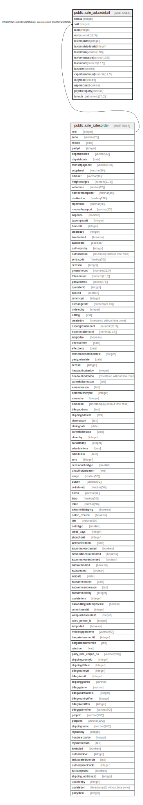

# public.sale_sotaxdetail

## Description

## Columns

| Name | Type | Default | Nullable | Children | Parents | Comment |
| ---- | ---- | ------- | -------- | -------- | ------- | ------- |
| sotaxid | integer | nextval('sale_sotaxdetail_sotaxid_seq'::regclass) | false |  |  |  |
| soid | integer |  | true |  | [public.sale_salesorder](public.sale_salesorder.md) |  |
| taxid | integer |  | true |  |  |  |
| rate | numeric(12,3) |  | true |  |  |  |
| taxtemplateid | integer |  | true |  |  |  |
| taxtemplatedetailid | integer |  | true |  |  |  |
| taxformula | varchar(150) |  | true |  |  |  |
| taxformulavalue | varchar(150) |  | true |  |  |  |
| taxamount | numeric(17,5) | 0 | true |  |  |  |
| taxorder | smallint |  | true |  |  |  |
| exporttaxamount | numeric(17,5) |  | true |  |  |  |
| dutyhead | smallint |  | true |  |  |  |
| asperactual | boolean | false | true |  |  |  |
| payabletoparty | boolean | true | true |  |  |  |
| formula_on | numeric(17,5) |  | true |  |  |  |

## Constraints

| Name | Type | Definition |
| ---- | ---- | ---------- |
| sotaxdetail_fk | FOREIGN KEY | FOREIGN KEY (soid) REFERENCES sale_salesorder(soid) ON UPDATE CASCADE |
| sotaxdetail_pkey | PRIMARY KEY | PRIMARY KEY (sotaxid) |

## Indexes

| Name | Definition |
| ---- | ---------- |
| sotaxdetail_pkey | CREATE UNIQUE INDEX sotaxdetail_pkey ON public.sale_sotaxdetail USING btree (sotaxid) |
| Index_SO_TaxDet_SOID | CREATE INDEX "Index_SO_TaxDet_SOID" ON public.sale_sotaxdetail USING btree (soid) |

## Relations

---

> Generated by [tbls](https://github.com/k1LoW/tbls)
