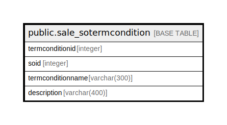

# public.sale_sotermcondition

## Description

## Columns

| Name | Type | Default | Nullable | Children | Parents | Comment |
| ---- | ---- | ------- | -------- | -------- | ------- | ------- |
| termconditionid | integer | nextval('sale_sotermcondition_termconditionid_seq'::regclass) | false |  |  |  |
| soid | integer |  | true |  |  |  |
| termconditionname | varchar(300) |  | true |  |  |  |
| description | varchar(400) |  | true |  |  |  |

## Constraints

| Name | Type | Definition |
| ---- | ---- | ---------- |
| sale_sotermcondition_pkey | PRIMARY KEY | PRIMARY KEY (termconditionid) |

## Indexes

| Name | Definition |
| ---- | ---------- |
| sale_sotermcondition_pkey | CREATE UNIQUE INDEX sale_sotermcondition_pkey ON public.sale_sotermcondition USING btree (termconditionid) |
| Index_SO_TerDet_SOID | CREATE INDEX "Index_SO_TerDet_SOID" ON public.sale_sotermcondition USING btree (soid) |

## Relations

---

> Generated by [tbls](https://github.com/k1LoW/tbls)
