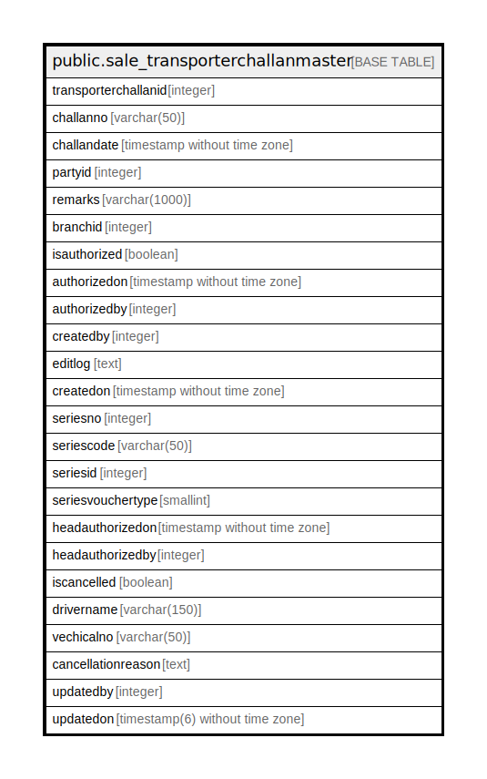

# public.sale_transporterchallanmaster

## Description

## Columns

| Name | Type | Default | Nullable | Children | Parents | Comment |
| ---- | ---- | ------- | -------- | -------- | ------- | ------- |
| transporterchallanid | integer | nextval('sale_transporterchallanmaster_transporterchallanid_seq'::regclass) | false |  |  |  |
| challanno | varchar(50) |  | true |  |  |  |
| challandate | timestamp without time zone |  | true |  |  |  |
| partyid | integer |  | true |  |  |  |
| remarks | varchar(1000) |  | true |  |  |  |
| branchid | integer |  | true |  |  |  |
| isauthorized | boolean | false | false |  |  |  |
| authorizedon | timestamp without time zone |  | true |  |  |  |
| authorizedby | integer |  | true |  |  |  |
| createdby | integer |  | true |  |  |  |
| editlog | text |  | true |  |  |  |
| createdon | timestamp without time zone | now() | true |  |  |  |
| seriesno | integer |  | true |  |  |  |
| seriescode | varchar(50) |  | true |  |  |  |
| seriesid | integer |  | true |  |  |  |
| seriesvouchertype | smallint | 0 | true |  |  |  |
| headauthorizedon | timestamp without time zone |  | true |  |  |  |
| headauthorizedby | integer |  | true |  |  |  |
| iscancelled | boolean | false | false |  |  |  |
| drivername | varchar(150) | ''::character varying | false |  |  |  |
| vechicalno | varchar(50) | ''::character varying | false |  |  |  |
| cancellationreason | text | ''::text | false |  |  |  |
| updatedby | integer |  | true |  |  |  |
| updatedon | timestamp(6) without time zone | NULL::timestamp without time zone | true |  |  |  |

## Constraints

| Name | Type | Definition |
| ---- | ---- | ---------- |
| sale_transporterchallanmaster_pkey | PRIMARY KEY | PRIMARY KEY (transporterchallanid) |

## Indexes

| Name | Definition |
| ---- | ---------- |
| sale_transporterchallanmaster_pkey | CREATE UNIQUE INDEX sale_transporterchallanmaster_pkey ON public.sale_transporterchallanmaster USING btree (transporterchallanid) |

## Relations

---

> Generated by [tbls](https://github.com/k1LoW/tbls)
