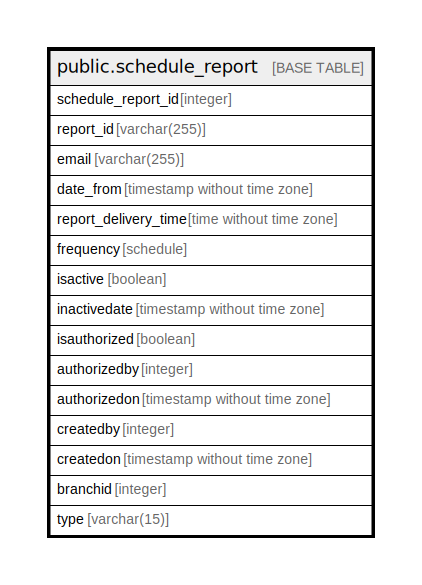

# public.schedule_report

## Description

## Columns

| Name | Type | Default | Nullable | Children | Parents | Comment |
| ---- | ---- | ------- | -------- | -------- | ------- | ------- |
| schedule_report_id | integer | nextval('schedule_report_schedule_report_id_seq'::regclass) | false |  |  |  |
| report_id | varchar(255) |  | false |  |  |  |
| email | varchar(255) |  | true |  |  |  |
| date_from | timestamp without time zone |  | true |  |  |  |
| report_delivery_time | time without time zone |  | true |  |  |  |
| frequency | schedule |  | true |  |  |  |
| isactive | boolean |  | false |  |  |  |
| inactivedate | timestamp without time zone |  | true |  |  |  |
| isauthorized | boolean | false | false |  |  |  |
| authorizedby | integer |  | true |  |  |  |
| authorizedon | timestamp without time zone |  | true |  |  |  |
| createdby | integer |  | true |  |  |  |
| createdon | timestamp without time zone | now() | true |  |  |  |
| branchid | integer |  | true |  |  |  |
| type | varchar(15) |  | true |  |  |  |

## Constraints

| Name | Type | Definition |
| ---- | ---- | ---------- |
| schedule_report_pkey | PRIMARY KEY | PRIMARY KEY (schedule_report_id) |

## Indexes

| Name | Definition |
| ---- | ---------- |
| schedule_report_pkey | CREATE UNIQUE INDEX schedule_report_pkey ON public.schedule_report USING btree (schedule_report_id) |

## Relations

---

> Generated by [tbls](https://github.com/k1LoW/tbls)
