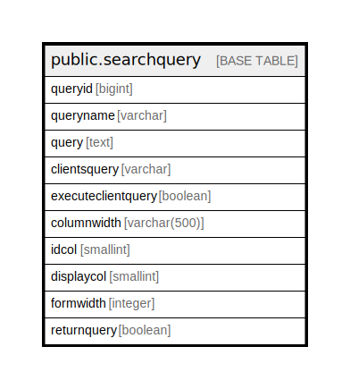

# public.searchquery

## Description

## Columns

| Name | Type | Default | Nullable | Children | Parents | Comment |
| ---- | ---- | ------- | -------- | -------- | ------- | ------- |
| queryid | bigint | nextval('searchquery_queryid_seq'::regclass) | false |  |  |  |
| queryname | varchar |  | true |  |  |  |
| query | text |  | false |  |  |  |
| clientsquery | varchar |  | true |  |  |  |
| executeclientquery | boolean | false | true |  |  |  |
| columnwidth | varchar(500) |  | true |  |  |  |
| idcol | smallint |  | true |  |  |  |
| displaycol | smallint |  | true |  |  |  |
| formwidth | integer | 1030 | true |  |  |  |
| returnquery | boolean | false | true |  |  |  |

## Constraints

| Name | Type | Definition |
| ---- | ---- | ---------- |
| uq_queryid | PRIMARY KEY | PRIMARY KEY (queryid) |
| uq_queryname | UNIQUE | UNIQUE (queryname) |

## Indexes

| Name | Definition |
| ---- | ---------- |
| uq_queryid | CREATE UNIQUE INDEX uq_queryid ON public.searchquery USING btree (queryid) |
| uq_queryname | CREATE UNIQUE INDEX uq_queryname ON public.searchquery USING btree (queryname) |

## Relations

---

> Generated by [tbls](https://github.com/k1LoW/tbls)
