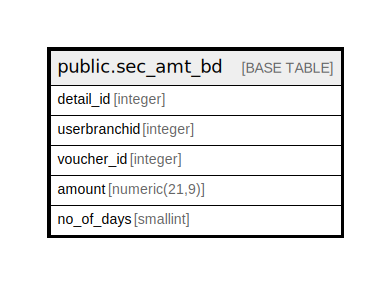

# public.sec_amt_bd

## Description

## Columns

| Name | Type | Default | Nullable | Children | Parents | Comment |
| ---- | ---- | ------- | -------- | -------- | ------- | ------- |
| detail_id | integer | nextval('sec_amt_bd_detail_id_seq'::regclass) | false |  |  |  |
| userbranchid | integer |  | true |  |  |  |
| voucher_id | integer |  | true |  |  |  |
| amount | numeric(21,9) | 0 | true |  |  |  |
| no_of_days | smallint | 0 | true |  |  |  |

## Constraints

| Name | Type | Definition |
| ---- | ---- | ---------- |
| sec_amt_bd_pkey | PRIMARY KEY | PRIMARY KEY (detail_id) |

## Indexes

| Name | Definition |
| ---- | ---------- |
| sec_amt_bd_pkey | CREATE UNIQUE INDEX sec_amt_bd_pkey ON public.sec_amt_bd USING btree (detail_id) |

## Relations

---

> Generated by [tbls](https://github.com/k1LoW/tbls)
