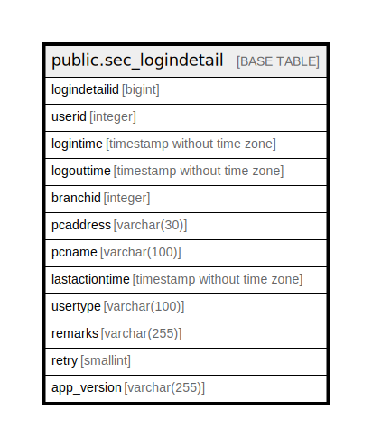

# public.sec_logindetail

## Description

## Columns

| Name | Type | Default | Nullable | Children | Parents | Comment |
| ---- | ---- | ------- | -------- | -------- | ------- | ------- |
| logindetailid | bigint | nextval('sec_logindetail_logindetailid_seq'::regclass) | false |  |  |  |
| userid | integer |  | true |  |  |  |
| logintime | timestamp without time zone | now() | true |  |  |  |
| logouttime | timestamp without time zone |  | true |  |  |  |
| branchid | integer |  | true |  |  |  |
| pcaddress | varchar(30) |  | true |  |  |  |
| pcname | varchar(100) |  | true |  |  |  |
| lastactiontime | timestamp without time zone | now() | true |  |  |  |
| usertype | varchar(100) |  | true |  |  |  |
| remarks | varchar(255) |  | true |  |  |  |
| retry | smallint | 0 | true |  |  |  |
| app_version | varchar(255) |  | true |  |  |  |

## Constraints

| Name | Type | Definition |
| ---- | ---- | ---------- |
| sec_logindetail_pkey | PRIMARY KEY | PRIMARY KEY (logindetailid) |

## Indexes

| Name | Definition |
| ---- | ---------- |
| sec_logindetail_pkey | CREATE UNIQUE INDEX sec_logindetail_pkey ON public.sec_logindetail USING btree (logindetailid) |

## Relations

---

> Generated by [tbls](https://github.com/k1LoW/tbls)
