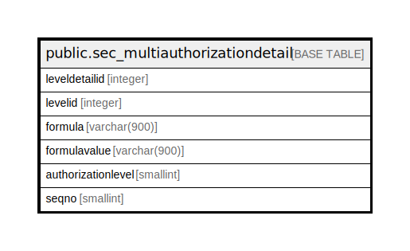

# public.sec_multiauthorizationdetail

## Description

## Columns

| Name | Type | Default | Nullable | Children | Parents | Comment |
| ---- | ---- | ------- | -------- | -------- | ------- | ------- |
| leveldetailid | integer | nextval('sec_multiauthorizationdetail_leveldetailid_seq'::regclass) | false |  |  |  |
| levelid | integer |  | true |  |  |  |
| formula | varchar(900) |  | true |  |  |  |
| formulavalue | varchar(900) |  | true |  |  |  |
| authorizationlevel | smallint |  | true |  |  |  |
| seqno | smallint |  | true |  |  |  |

## Constraints

| Name | Type | Definition |
| ---- | ---- | ---------- |
| sec_multiauthorizationdetail_pkey | PRIMARY KEY | PRIMARY KEY (leveldetailid) |

## Indexes

| Name | Definition |
| ---- | ---------- |
| sec_multiauthorizationdetail_pkey | CREATE UNIQUE INDEX sec_multiauthorizationdetail_pkey ON public.sec_multiauthorizationdetail USING btree (leveldetailid) |

## Relations

---

> Generated by [tbls](https://github.com/k1LoW/tbls)
