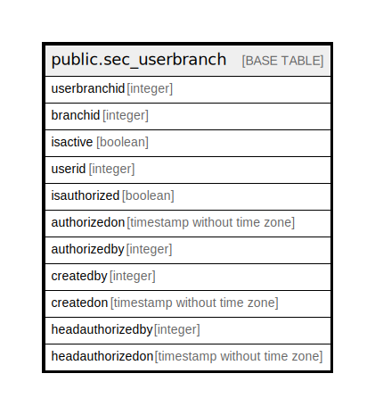

# public.sec_userbranch

## Description

## Columns

| Name | Type | Default | Nullable | Children | Parents | Comment |
| ---- | ---- | ------- | -------- | -------- | ------- | ------- |
| userbranchid | integer | nextval('sec_userbranch_userbranchid_seq'::regclass) | false |  |  |  |
| branchid | integer |  | true |  |  |  |
| isactive | boolean | false | false |  |  |  |
| userid | integer |  | true |  |  |  |
| isauthorized | boolean | false | false |  |  |  |
| authorizedon | timestamp without time zone |  | true |  |  |  |
| authorizedby | integer |  | true |  |  |  |
| createdby | integer |  | true |  |  |  |
| createdon | timestamp without time zone |  | true |  |  |  |
| headauthorizedby | integer |  | true |  |  |  |
| headauthorizedon | timestamp without time zone |  | true |  |  |  |

## Constraints

| Name | Type | Definition |
| ---- | ---- | ---------- |
| userbranch_pkey | PRIMARY KEY | PRIMARY KEY (userbranchid) |

## Indexes

| Name | Definition |
| ---- | ---------- |
| userbranch_pkey | CREATE UNIQUE INDEX userbranch_pkey ON public.sec_userbranch USING btree (userbranchid) |

## Relations

---

> Generated by [tbls](https://github.com/k1LoW/tbls)
