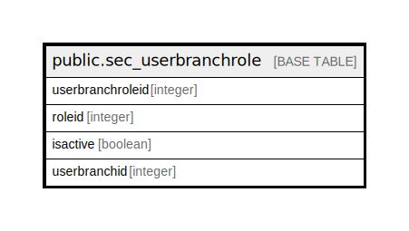

# public.sec_userbranchrole

## Description

## Columns

| Name | Type | Default | Nullable | Children | Parents | Comment |
| ---- | ---- | ------- | -------- | -------- | ------- | ------- |
| userbranchroleid | integer | nextval('sec_userbranchrole_userbranchroleid_seq'::regclass) | false |  |  |  |
| roleid | integer |  | true |  |  |  |
| isactive | boolean | false | true |  |  |  |
| userbranchid | integer |  | true |  |  |  |

## Constraints

| Name | Type | Definition |
| ---- | ---- | ---------- |
| userbranchrole_pkey | PRIMARY KEY | PRIMARY KEY (userbranchroleid) |

## Indexes

| Name | Definition |
| ---- | ---------- |
| userbranchrole_pkey | CREATE UNIQUE INDEX userbranchrole_pkey ON public.sec_userbranchrole USING btree (userbranchroleid) |

## Relations

---

> Generated by [tbls](https://github.com/k1LoW/tbls)
