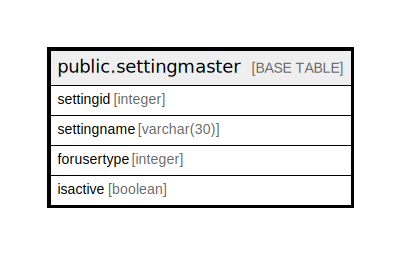

# public.settingmaster

## Description

## Columns

| Name | Type | Default | Nullable | Children | Parents | Comment |
| ---- | ---- | ------- | -------- | -------- | ------- | ------- |
| settingid | integer | nextval('settingmaster_settingid_seq'::regclass) | false |  |  |  |
| settingname | varchar(30) |  | true |  |  |  |
| forusertype | integer |  | true |  |  |  |
| isactive | boolean | true | true |  |  |  |

## Constraints

| Name | Type | Definition |
| ---- | ---- | ---------- |
| settingmaster_pkey | PRIMARY KEY | PRIMARY KEY (settingid) |

## Indexes

| Name | Definition |
| ---- | ---------- |
| settingmaster_pkey | CREATE UNIQUE INDEX settingmaster_pkey ON public.settingmaster USING btree (settingid) |

## Relations

---

> Generated by [tbls](https://github.com/k1LoW/tbls)
