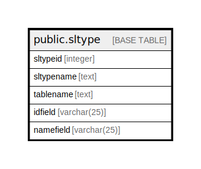

# public.sltype

## Description

## Columns

| Name | Type | Default | Nullable | Children | Parents | Comment |
| ---- | ---- | ------- | -------- | -------- | ------- | ------- |
| sltypeid | integer |  | false |  |  |  |
| sltypename | text |  | true |  |  |  |
| tablename | text |  | true |  |  |  |
| idfield | varchar(25) |  | true |  |  |  |
| namefield | varchar(25) |  | true |  |  |  |

## Constraints

| Name | Type | Definition |
| ---- | ---- | ---------- |
| sltype_pkey | PRIMARY KEY | PRIMARY KEY (sltypeid) |

## Indexes

| Name | Definition |
| ---- | ---------- |
| sltype_pkey | CREATE UNIQUE INDEX sltype_pkey ON public.sltype USING btree (sltypeid) |

## Relations

---

> Generated by [tbls](https://github.com/k1LoW/tbls)
