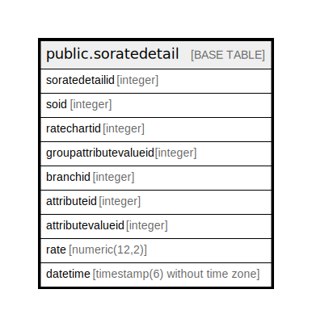

# public.soratedetail

## Description

## Columns

| Name | Type | Default | Nullable | Children | Parents | Comment |
| ---- | ---- | ------- | -------- | -------- | ------- | ------- |
| soratedetailid | integer | nextval('soratedetail_soratedetailid_seq'::regclass) | false |  |  |  |
| soid | integer |  | true |  |  |  |
| ratechartid | integer |  | true |  |  |  |
| groupattributevalueid | integer |  | true |  |  |  |
| branchid | integer |  | true |  |  |  |
| attributeid | integer |  | true |  |  |  |
| attributevalueid | integer |  | true |  |  |  |
| rate | numeric(12,2) |  | true |  |  |  |
| datetime | timestamp(6) without time zone | now() | true |  |  |  |

## Relations

---

> Generated by [tbls](https://github.com/k1LoW/tbls)
