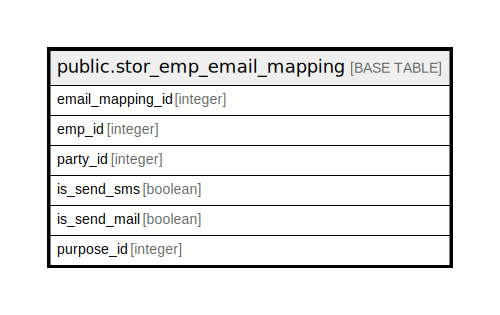

# public.stor_emp_email_mapping

## Description

## Columns

| Name | Type | Default | Nullable | Children | Parents | Comment |
| ---- | ---- | ------- | -------- | -------- | ------- | ------- |
| email_mapping_id | integer | nextval('stor_emp_email_mapping_email_mapping_id_seq'::regclass) | false |  |  |  |
| emp_id | integer |  | true |  |  |  |
| party_id | integer |  | true |  |  |  |
| is_send_sms | boolean |  | true |  |  |  |
| is_send_mail | boolean |  | true |  |  |  |
| purpose_id | integer |  | true |  |  |  |

## Constraints

| Name | Type | Definition |
| ---- | ---- | ---------- |
| stor_emp_email_mapping_pkey | PRIMARY KEY | PRIMARY KEY (email_mapping_id) |

## Indexes

| Name | Definition |
| ---- | ---------- |
| stor_emp_email_mapping_pkey | CREATE UNIQUE INDEX stor_emp_email_mapping_pkey ON public.stor_emp_email_mapping USING btree (email_mapping_id) |

## Relations

---

> Generated by [tbls](https://github.com/k1LoW/tbls)
