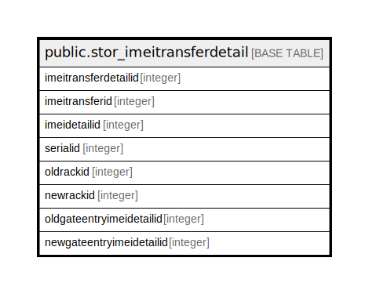

# public.stor_imeitransferdetail

## Description

## Columns

| Name | Type | Default | Nullable | Children | Parents | Comment |
| ---- | ---- | ------- | -------- | -------- | ------- | ------- |
| imeitransferdetailid | integer | nextval('stor_imeitransferdetail_imeitransferdetailid_seq'::regclass) | false |  |  |  |
| imeitransferid | integer |  | true |  |  |  |
| imeidetailid | integer |  | true |  |  |  |
| serialid | integer |  | true |  |  |  |
| oldrackid | integer |  | true |  |  |  |
| newrackid | integer |  | true |  |  |  |
| oldgateentryimeidetailid | integer | 0 | false |  |  |  |
| newgateentryimeidetailid | integer | 0 | false |  |  |  |

## Constraints

| Name | Type | Definition |
| ---- | ---- | ---------- |
| stor_imeitransferdetail_pkey | PRIMARY KEY | PRIMARY KEY (imeitransferdetailid) |

## Indexes

| Name | Definition |
| ---- | ---------- |
| stor_imeitransferdetail_pkey | CREATE UNIQUE INDEX stor_imeitransferdetail_pkey ON public.stor_imeitransferdetail USING btree (imeitransferdetailid) |

## Triggers

| Name | Definition |
| ---- | ---------- |
| oldgateentryimeidetailid | CREATE TRIGGER oldgateentryimeidetailid AFTER INSERT OR UPDATE ON public.stor_imeitransferdetail FOR EACH ROW EXECUTE FUNCTION tgr_cartonstatusingateentryimeidetail() |

## Relations

---

> Generated by [tbls](https://github.com/k1LoW/tbls)
