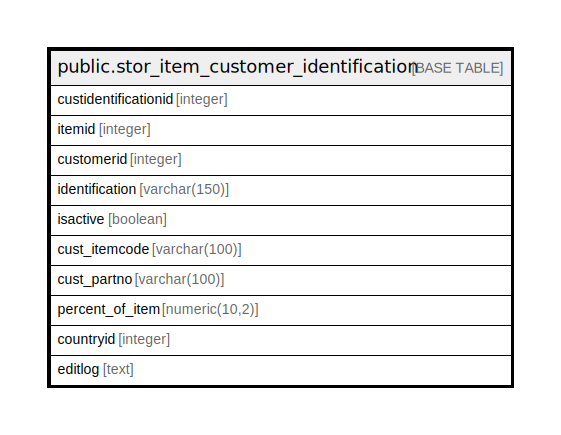

# public.stor_item_customer_identification

## Description

## Columns

| Name | Type | Default | Nullable | Children | Parents | Comment |
| ---- | ---- | ------- | -------- | -------- | ------- | ------- |
| custidentificationid | integer | nextval('stor_item_customer_identification_custidentificationid_seq'::regclass) | false |  |  |  |
| itemid | integer |  | true |  |  |  |
| customerid | integer |  | true |  |  |  |
| identification | varchar(150) |  | true |  |  |  |
| isactive | boolean | true | true |  |  |  |
| cust_itemcode | varchar(100) |  | true |  |  |  |
| cust_partno | varchar(100) |  | true |  |  |  |
| percent_of_item | numeric(10,2) | 0 | false |  |  |  |
| countryid | integer |  | true |  |  |  |
| editlog | text |  | true |  |  |  |

## Constraints

| Name | Type | Definition |
| ---- | ---- | ---------- |
| stor_item_customer_identification_pkey | PRIMARY KEY | PRIMARY KEY (custidentificationid, percent_of_item) |

## Indexes

| Name | Definition |
| ---- | ---------- |
| stor_item_customer_identification_pkey | CREATE UNIQUE INDEX stor_item_customer_identification_pkey ON public.stor_item_customer_identification USING btree (custidentificationid, percent_of_item) |
| Index_ItemCust_ItemID | CREATE INDEX "Index_ItemCust_ItemID" ON public.stor_item_customer_identification USING btree (itemid) |

## Triggers

| Name | Definition |
| ---- | ---------- |
| tgr_update_series | CREATE TRIGGER tgr_update_series AFTER INSERT ON public.stor_item_customer_identification FOR EACH ROW EXECUTE FUNCTION tgr_update_series() |

## Relations

---

> Generated by [tbls](https://github.com/k1LoW/tbls)
