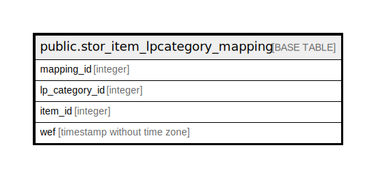

# public.stor_item_lpcategory_mapping

## Description

## Columns

| Name | Type | Default | Nullable | Children | Parents | Comment |
| ---- | ---- | ------- | -------- | -------- | ------- | ------- |
| mapping_id | integer | nextval('stor_item_lpcategory_mapping_mapping_id_seq'::regclass) | false |  |  |  |
| lp_category_id | integer |  | true |  |  |  |
| item_id | integer |  | true |  |  |  |
| wef | timestamp without time zone |  | true |  |  |  |

## Constraints

| Name | Type | Definition |
| ---- | ---- | ---------- |
| stor_item_lpcategory_mapping_pkey | PRIMARY KEY | PRIMARY KEY (mapping_id) |

## Indexes

| Name | Definition |
| ---- | ---------- |
| stor_item_lpcategory_mapping_pkey | CREATE UNIQUE INDEX stor_item_lpcategory_mapping_pkey ON public.stor_item_lpcategory_mapping USING btree (mapping_id) |

## Relations

---

> Generated by [tbls](https://github.com/k1LoW/tbls)
