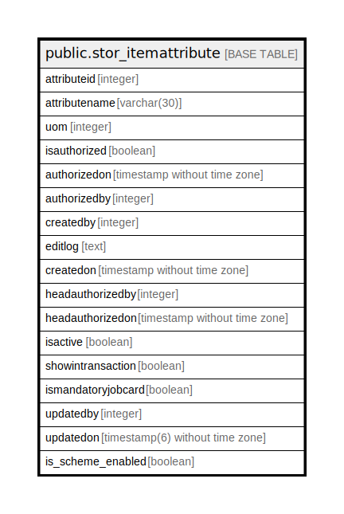

# public.stor_itemattribute

## Description

## Columns

| Name | Type | Default | Nullable | Children | Parents | Comment |
| ---- | ---- | ------- | -------- | -------- | ------- | ------- |
| attributeid | integer | nextval(('"public"."stor_itemattribute_attributeid_seq"'::text)::regclass) | false |  |  |  |
| attributename | varchar(30) |  | true |  |  |  |
| uom | integer |  | true |  |  |  |
| isauthorized | boolean | false | false |  |  |  |
| authorizedon | timestamp without time zone |  | true |  |  |  |
| authorizedby | integer |  | true |  |  |  |
| createdby | integer |  | true |  |  |  |
| editlog | text |  | true |  |  |  |
| createdon | timestamp without time zone | now() | true |  |  |  |
| headauthorizedby | integer |  | true |  |  |  |
| headauthorizedon | timestamp without time zone |  | true |  |  |  |
| isactive | boolean | true | true |  |  |  |
| showintransaction | boolean | false | true |  |  |  |
| ismandatoryjobcard | boolean | false | true |  |  |  |
| updatedby | integer |  | true |  |  |  |
| updatedon | timestamp(6) without time zone | NULL::timestamp without time zone | true |  |  |  |
| is_scheme_enabled | boolean | false | true |  |  |  |

## Constraints

| Name | Type | Definition |
| ---- | ---- | ---------- |
| itemattribute_attributename_key | UNIQUE | UNIQUE (attributename) |
| itemattribute_pkey | PRIMARY KEY | PRIMARY KEY (attributeid) |

## Indexes

| Name | Definition |
| ---- | ---------- |
| itemattribute_attributename_key | CREATE UNIQUE INDEX itemattribute_attributename_key ON public.stor_itemattribute USING btree (attributename) |
| itemattribute_pkey | CREATE UNIQUE INDEX itemattribute_pkey ON public.stor_itemattribute USING btree (attributeid) |

## Relations

---

> Generated by [tbls](https://github.com/k1LoW/tbls)
