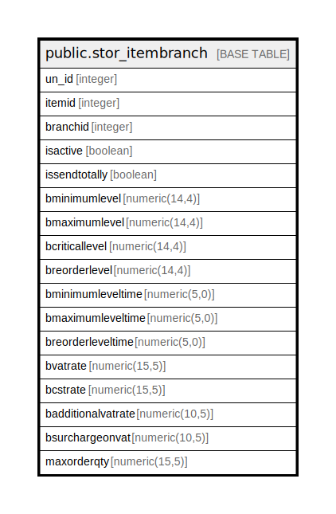

# public.stor_itembranch

## Description

## Columns

| Name | Type | Default | Nullable | Children | Parents | Comment |
| ---- | ---- | ------- | -------- | -------- | ------- | ------- |
| un_id | integer | nextval('stor_itembranch_un_id_seq'::regclass) | false |  |  |  |
| itemid | integer |  | true |  |  |  |
| branchid | integer |  | true |  |  |  |
| isactive | boolean |  | true |  |  |  |
| issendtotally | boolean |  | true |  |  |  |
| bminimumlevel | numeric(14,4) |  | true |  |  |  |
| bmaximumlevel | numeric(14,4) |  | true |  |  |  |
| bcriticallevel | numeric(14,4) |  | true |  |  |  |
| breorderlevel | numeric(14,4) |  | true |  |  |  |
| bminimumleveltime | numeric(5,0) |  | true |  |  |  |
| bmaximumleveltime | numeric(5,0) |  | true |  |  |  |
| breorderleveltime | numeric(5,0) |  | true |  |  |  |
| bvatrate | numeric(15,5) |  | true |  |  |  |
| bcstrate | numeric(15,5) |  | true |  |  |  |
| badditionalvatrate | numeric(10,5) |  | true |  |  |  |
| bsurchargeonvat | numeric(10,5) |  | true |  |  |  |
| maxorderqty | numeric(15,5) | 0 | true |  |  |  |

## Constraints

| Name | Type | Definition |
| ---- | ---- | ---------- |
| stor_itembranch_pkey | PRIMARY KEY | PRIMARY KEY (un_id) |
| unique_branchanditemid | UNIQUE | UNIQUE (itemid, branchid) |

## Indexes

| Name | Definition |
| ---- | ---------- |
| stor_itembranch_pkey | CREATE UNIQUE INDEX stor_itembranch_pkey ON public.stor_itembranch USING btree (un_id) |
| unique_branchanditemid | CREATE UNIQUE INDEX unique_branchanditemid ON public.stor_itembranch USING btree (itemid, branchid) |

## Relations

---

> Generated by [tbls](https://github.com/k1LoW/tbls)
