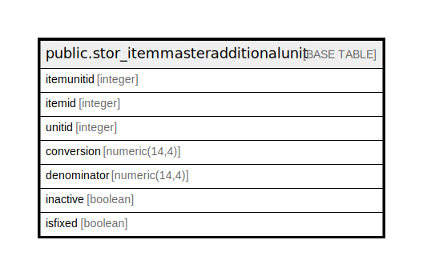

# public.stor_itemmasteradditionalunit

## Description

## Columns

| Name | Type | Default | Nullable | Children | Parents | Comment |
| ---- | ---- | ------- | -------- | -------- | ------- | ------- |
| itemunitid | integer | nextval('stor_itemmasteradditionalunit_itemunitid_seq'::regclass) | false |  |  |  |
| itemid | integer |  | true |  |  |  |
| unitid | integer |  | true |  |  |  |
| conversion | numeric(14,4) |  | true |  |  |  |
| denominator | numeric(14,4) |  | true |  |  |  |
| inactive | boolean | false | true |  |  |  |
| isfixed | boolean | false | true |  |  |  |

## Constraints

| Name | Type | Definition |
| ---- | ---- | ---------- |
| stor_itemmasteradditionalunit_pkey | PRIMARY KEY | PRIMARY KEY (itemunitid) |

## Indexes

| Name | Definition |
| ---- | ---------- |
| stor_itemmasteradditionalunit_pkey | CREATE UNIQUE INDEX stor_itemmasteradditionalunit_pkey ON public.stor_itemmasteradditionalunit USING btree (itemunitid) |

## Relations

---

> Generated by [tbls](https://github.com/k1LoW/tbls)
