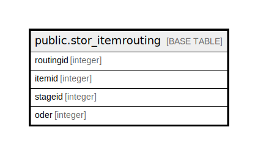

# public.stor_itemrouting

## Description

## Columns

| Name | Type | Default | Nullable | Children | Parents | Comment |
| ---- | ---- | ------- | -------- | -------- | ------- | ------- |
| routingid | integer | nextval('stor_itemrouting_routingid_seq'::regclass) | false |  |  |  |
| itemid | integer |  | true |  |  |  |
| stageid | integer |  | true |  |  |  |
| oder | integer |  | true |  |  |  |

## Constraints

| Name | Type | Definition |
| ---- | ---- | ---------- |
| stor_itemrouting_pkey | PRIMARY KEY | PRIMARY KEY (routingid) |

## Indexes

| Name | Definition |
| ---- | ---------- |
| stor_itemrouting_pkey | CREATE UNIQUE INDEX stor_itemrouting_pkey ON public.stor_itemrouting USING btree (routingid) |

## Relations

---

> Generated by [tbls](https://github.com/k1LoW/tbls)
