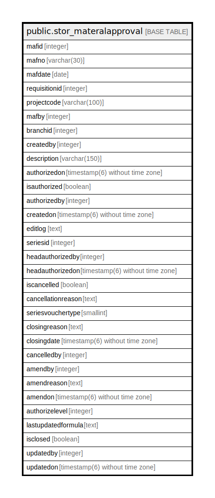

# public.stor_materalapproval

## Description

## Columns

| Name | Type | Default | Nullable | Children | Parents | Comment |
| ---- | ---- | ------- | -------- | -------- | ------- | ------- |
| mafid | integer | nextval('stor_materalapproval_mafid_seq'::regclass) | false |  |  |  |
| mafno | varchar(30) |  | true |  |  |  |
| mafdate | date |  | true |  |  |  |
| requisitionid | integer |  | true |  |  |  |
| projectcode | varchar(100) |  | true |  |  |  |
| mafby | integer |  | true |  |  |  |
| branchid | integer |  | true |  |  |  |
| createdby | integer |  | true |  |  |  |
| description | varchar(150) |  | true |  |  |  |
| authorizedon | timestamp(6) without time zone |  | true |  |  |  |
| isauthorized | boolean | false | false |  |  |  |
| authorizedby | integer |  | true |  |  |  |
| createdon | timestamp(6) without time zone | now() | true |  |  |  |
| editlog | text |  | true |  |  |  |
| seriesid | integer |  | true |  |  |  |
| headauthorizedby | integer |  | true |  |  |  |
| headauthorizedon | timestamp(6) without time zone |  | true |  |  |  |
| iscancelled | boolean | false | true |  |  |  |
| cancellationreason | text |  | true |  |  |  |
| seriesvouchertype | smallint | 0 | true |  |  |  |
| closingreason | text |  | true |  |  |  |
| closingdate | timestamp(6) without time zone |  | true |  |  |  |
| cancelledby | integer |  | true |  |  |  |
| amendby | integer |  | true |  |  |  |
| amendreason | text |  | true |  |  |  |
| amendon | timestamp(6) without time zone |  | true |  |  |  |
| authorizelevel | integer | 0 | true |  |  |  |
| lastupdatedformula | text |  | true |  |  |  |
| isclosed | boolean |  | true |  |  |  |
| updatedby | integer |  | true |  |  |  |
| updatedon | timestamp(6) without time zone | NULL::timestamp without time zone | true |  |  |  |

## Constraints

| Name | Type | Definition |
| ---- | ---- | ---------- |
| stor_materalapproval_pkey | PRIMARY KEY | PRIMARY KEY (mafid) |

## Indexes

| Name | Definition |
| ---- | ---------- |
| stor_materalapproval_pkey | CREATE UNIQUE INDEX stor_materalapproval_pkey ON public.stor_materalapproval USING btree (mafid) |

## Triggers

| Name | Definition |
| ---- | ---------- |
| stor_materalapprovaldetail_amendlog | CREATE TRIGGER stor_materalapprovaldetail_amendlog AFTER UPDATE ON public.stor_materalapproval FOR EACH ROW EXECUTE FUNCTION stor_materalapprovaldetail_amendlog() |

## Relations

---

> Generated by [tbls](https://github.com/k1LoW/tbls)
