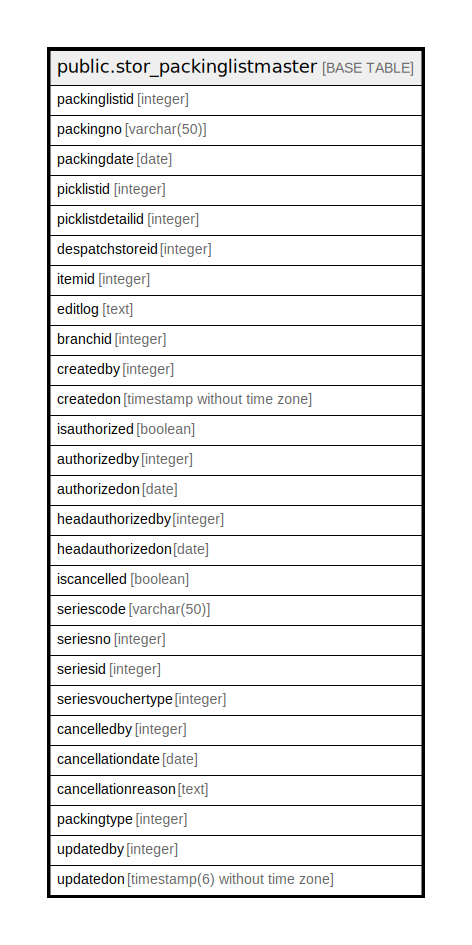

# public.stor_packinglistmaster

## Description

## Columns

| Name | Type | Default | Nullable | Children | Parents | Comment |
| ---- | ---- | ------- | -------- | -------- | ------- | ------- |
| packinglistid | integer | nextval('stor_packinglistmaster_packinglistid_seq'::regclass) | false |  |  |  |
| packingno | varchar(50) | NULL::character varying | true |  |  |  |
| packingdate | date |  | true |  |  |  |
| picklistid | integer |  | true |  |  |  |
| picklistdetailid | integer |  | true |  |  |  |
| despatchstoreid | integer |  | true |  |  |  |
| itemid | integer |  | true |  |  |  |
| editlog | text |  | true |  |  |  |
| branchid | integer |  | true |  |  |  |
| createdby | integer |  | true |  |  |  |
| createdon | timestamp without time zone | now() | true |  |  |  |
| isauthorized | boolean | false | true |  |  |  |
| authorizedby | integer |  | true |  |  |  |
| authorizedon | date |  | true |  |  |  |
| headauthorizedby | integer |  | true |  |  |  |
| headauthorizedon | date |  | true |  |  |  |
| iscancelled | boolean | false | true |  |  |  |
| seriescode | varchar(50) |  | true |  |  |  |
| seriesno | integer |  | true |  |  |  |
| seriesid | integer |  | true |  |  |  |
| seriesvouchertype | integer | 0 | true |  |  |  |
| cancelledby | integer |  | true |  |  |  |
| cancellationdate | date |  | true |  |  |  |
| cancellationreason | text |  | true |  |  |  |
| packingtype | integer | 0 | true |  |  |  |
| updatedby | integer |  | true |  |  |  |
| updatedon | timestamp(6) without time zone | NULL::timestamp without time zone | true |  |  |  |

## Constraints

| Name | Type | Definition |
| ---- | ---- | ---------- |
| stor_packinglistmaster_pkey | PRIMARY KEY | PRIMARY KEY (packinglistid) |

## Indexes

| Name | Definition |
| ---- | ---------- |
| stor_packinglistmaster_pkey | CREATE UNIQUE INDEX stor_packinglistmaster_pkey ON public.stor_packinglistmaster USING btree (packinglistid) |

## Relations

---

> Generated by [tbls](https://github.com/k1LoW/tbls)
