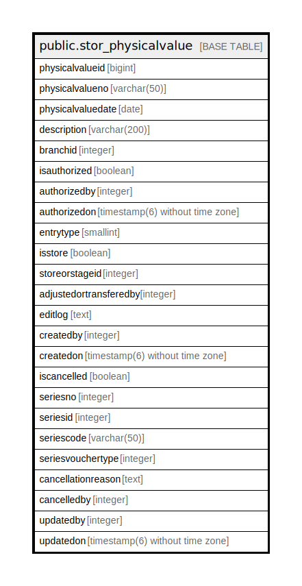

# public.stor_physicalvalue

## Description

## Columns

| Name | Type | Default | Nullable | Children | Parents | Comment |
| ---- | ---- | ------- | -------- | -------- | ------- | ------- |
| physicalvalueid | bigint | nextval('stor_physicalvalue_physicalvalueid_seq'::regclass) | false |  |  |  |
| physicalvalueno | varchar(50) |  | true |  |  |  |
| physicalvaluedate | date |  | true |  |  |  |
| description | varchar(200) |  | true |  |  |  |
| branchid | integer |  | true |  |  |  |
| isauthorized | boolean | false | false |  |  |  |
| authorizedby | integer |  | true |  |  |  |
| authorizedon | timestamp(6) without time zone |  | true |  |  |  |
| entrytype | smallint | 0 | true |  |  | 0  -Physical Value |
| isstore | boolean | true | true |  |  |  |
| storeorstageid | integer |  | true |  |  |  |
| adjustedortransferedby | integer |  | true |  |  |  |
| editlog | text |  | true |  |  |  |
| createdby | integer |  | true |  |  |  |
| createdon | timestamp(6) without time zone | now() | true |  |  |  |
| iscancelled | boolean | false | true |  |  |  |
| seriesno | integer |  | true |  |  |  |
| seriesid | integer |  | true |  |  |  |
| seriescode | varchar(50) |  | true |  |  |  |
| seriesvouchertype | integer |  | true |  |  |  |
| cancellationreason | text |  | true |  |  |  |
| cancelledby | integer |  | true |  |  |  |
| updatedby | integer |  | true |  |  |  |
| updatedon | timestamp(6) without time zone | NULL::timestamp without time zone | true |  |  |  |

## Constraints

| Name | Type | Definition |
| ---- | ---- | ---------- |
| stor_physicalvalue_pkey | PRIMARY KEY | PRIMARY KEY (physicalvalueid) |

## Indexes

| Name | Definition |
| ---- | ---------- |
| stor_physicalvalue_pkey | CREATE UNIQUE INDEX stor_physicalvalue_pkey ON public.stor_physicalvalue USING btree (physicalvalueid) |

## Relations

---

> Generated by [tbls](https://github.com/k1LoW/tbls)
