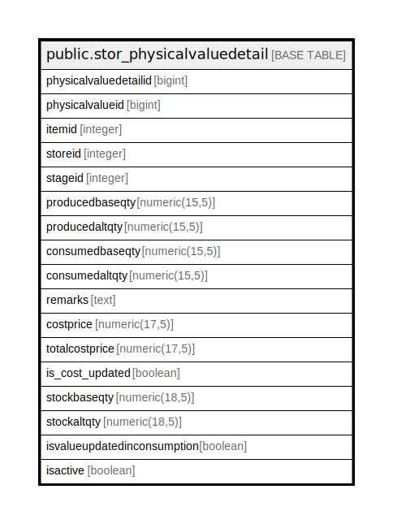

# public.stor_physicalvaluedetail

## Description

## Columns

| Name | Type | Default | Nullable | Children | Parents | Comment |
| ---- | ---- | ------- | -------- | -------- | ------- | ------- |
| physicalvaluedetailid | bigint | nextval('stor_physicalvaluedetail_physicalvaluedetailid_seq'::regclass) | false |  |  |  |
| physicalvalueid | bigint |  | true |  |  |  |
| itemid | integer |  | true |  |  |  |
| storeid | integer |  | true |  |  |  |
| stageid | integer |  | true |  |  |  |
| producedbaseqty | numeric(15,5) |  | true |  |  |  |
| producedaltqty | numeric(15,5) |  | true |  |  |  |
| consumedbaseqty | numeric(15,5) |  | true |  |  |  |
| consumedaltqty | numeric(15,5) |  | true |  |  |  |
| remarks | text |  | true |  |  |  |
| costprice | numeric(17,5) | 0 | true |  |  |  |
| totalcostprice | numeric(17,5) | 0 | true |  |  |  |
| is_cost_updated | boolean | true | false |  |  |  |
| stockbaseqty | numeric(18,5) |  | true |  |  |  |
| stockaltqty | numeric(18,5) |  | true |  |  |  |
| isvalueupdatedinconsumption | boolean | false | false |  |  |  |
| isactive | boolean | false | false |  |  |  |

## Constraints

| Name | Type | Definition |
| ---- | ---- | ---------- |
| stor_physicalvaluedetail_pkey | PRIMARY KEY | PRIMARY KEY (physicalvaluedetailid) |

## Indexes

| Name | Definition |
| ---- | ---------- |
| stor_physicalvaluedetail_pkey | CREATE UNIQUE INDEX stor_physicalvaluedetail_pkey ON public.stor_physicalvaluedetail USING btree (physicalvaluedetailid) |

## Relations

---

> Generated by [tbls](https://github.com/k1LoW/tbls)
