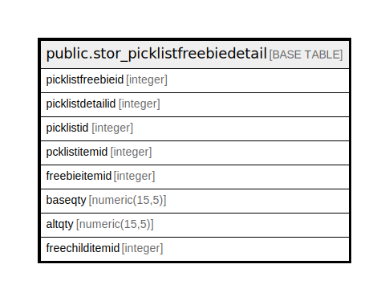

# public.stor_picklistfreebiedetail

## Description

## Columns

| Name | Type | Default | Nullable | Children | Parents | Comment |
| ---- | ---- | ------- | -------- | -------- | ------- | ------- |
| picklistfreebieid | integer | nextval('stor_picklistfreebiedetail_picklistfreebieid_seq'::regclass) | false |  |  |  |
| picklistdetailid | integer |  | true |  |  |  |
| picklistid | integer |  | true |  |  |  |
| pcklistitemid | integer |  | true |  |  |  |
| freebieitemid | integer |  | true |  |  |  |
| baseqty | numeric(15,5) |  | true |  |  |  |
| altqty | numeric(15,5) |  | true |  |  |  |
| freechilditemid | integer |  | true |  |  |  |

## Constraints

| Name | Type | Definition |
| ---- | ---- | ---------- |
| stor_picklistfreebiedetail_pkey | PRIMARY KEY | PRIMARY KEY (picklistfreebieid) |

## Indexes

| Name | Definition |
| ---- | ---------- |
| stor_picklistfreebiedetail_pkey | CREATE UNIQUE INDEX stor_picklistfreebiedetail_pkey ON public.stor_picklistfreebiedetail USING btree (picklistfreebieid) |

## Relations

---

> Generated by [tbls](https://github.com/k1LoW/tbls)
