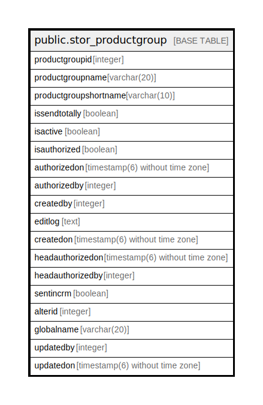

# public.stor_productgroup

## Description

## Columns

| Name | Type | Default | Nullable | Children | Parents | Comment |
| ---- | ---- | ------- | -------- | -------- | ------- | ------- |
| productgroupid | integer | nextval('stor_productgroup_productgroupid_seq'::regclass) | false |  |  |  |
| productgroupname | varchar(20) |  | true |  |  |  |
| productgroupshortname | varchar(10) |  | true |  |  |  |
| issendtotally | boolean | false | true |  |  |  |
| isactive | boolean | true | false |  |  |  |
| isauthorized | boolean | false | false |  |  |  |
| authorizedon | timestamp(6) without time zone |  | true |  |  |  |
| authorizedby | integer |  | true |  |  |  |
| createdby | integer |  | true |  |  |  |
| editlog | text |  | true |  |  |  |
| createdon | timestamp(6) without time zone | now() | true |  |  |  |
| headauthorizedon | timestamp(6) without time zone |  | true |  |  |  |
| headauthorizedby | integer |  | true |  |  |  |
| sentincrm | boolean | false | true |  |  |  |
| alterid | integer |  | true |  |  |  |
| globalname | varchar(20) |  | true |  |  |  |
| updatedby | integer |  | true |  |  |  |
| updatedon | timestamp(6) without time zone | NULL::timestamp without time zone | true |  |  |  |

## Constraints

| Name | Type | Definition |
| ---- | ---- | ---------- |
| stor_productgroup_key | PRIMARY KEY | PRIMARY KEY (productgroupid) |

## Indexes

| Name | Definition |
| ---- | ---------- |
| stor_productgroup_key | CREATE UNIQUE INDEX stor_productgroup_key ON public.stor_productgroup USING btree (productgroupid) |

## Relations

---

> Generated by [tbls](https://github.com/k1LoW/tbls)
