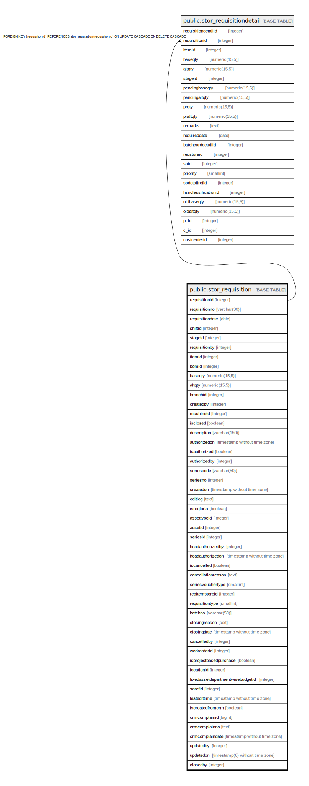

# public.stor_requisition

## Description

## Columns

| Name | Type | Default | Nullable | Children | Parents | Comment |
| ---- | ---- | ------- | -------- | -------- | ------- | ------- |
| requisitionid | integer | nextval('stor_requisition_requisitionid_seq'::regclass) | false | [public.stor_requisitiondetail](public.stor_requisitiondetail.md) |  |  |
| requisitionno | varchar(30) |  | true |  |  |  |
| requisitiondate | date |  | true |  |  |  |
| shiftid | integer |  | true |  |  |  |
| stageid | integer |  | true |  |  |  |
| requisitionby | integer |  | true |  |  |  |
| itemid | integer |  | true |  |  |  |
| bomid | integer |  | true |  |  |  |
| baseqty | numeric(15,5) |  | true |  |  |  |
| altqty | numeric(15,5) |  | true |  |  |  |
| branchid | integer |  | true |  |  |  |
| createdby | integer |  | true |  |  |  |
| machineid | integer |  | true |  |  |  |
| isclosed | boolean | false | false |  |  |  |
| description | varchar(150) |  | true |  |  |  |
| authorizedon | timestamp without time zone |  | true |  |  |  |
| isauthorized | boolean | false | false |  |  |  |
| authorizedby | integer |  | true |  |  |  |
| seriescode | varchar(50) |  | true |  |  |  |
| seriesno | integer |  | true |  |  |  |
| createdon | timestamp without time zone | now() | true |  |  |  |
| editlog | text |  | true |  |  |  |
| isreqforfa | boolean | false | false |  |  |  |
| assettypeid | integer |  | true |  |  |  |
| assetid | integer |  | true |  |  |  |
| seriesid | integer |  | true |  |  |  |
| headauthorizedby | integer |  | true |  |  |  |
| headauthorizedon | timestamp without time zone |  | true |  |  |  |
| iscancelled | boolean | false | true |  |  |  |
| cancellationreason | text |  | true |  |  |  |
| seriesvouchertype | smallint | 0 | true |  |  |  |
| reqitemstoreid | integer |  | true |  |  |  |
| requisitiontype | smallint | 0 | true |  |  | 0-Store Requisition 1-Store Requisition for Fixed Assed 2-Store Requisition From Stage 3-Store Requisition Against Batch Card |
| batchno | varchar(50) |  | true |  |  |  |
| closingreason | text |  | true |  |  |  |
| closingdate | timestamp without time zone |  | true |  |  |  |
| cancelledby | integer |  | true |  |  |  |
| workorderid | integer |  | true |  |  | It will be filled when stage id is -1 (Work Order Stage) |
| isprojectbasedpurchase | boolean | false | false |  |  |  |
| locationid | integer | 0 | false |  |  |  |
| fixedassetdepartmentwisebudgetid | integer | 0 | false |  |  |  |
| sorefid | integer |  | true |  |  |  |
| lastedittime | timestamp without time zone | now() | false |  |  |  |
| iscreatedfromcrm | boolean | false | true |  |  |  |
| crmcomplainid | bigint |  | true |  |  |  |
| crmcomplainno | text |  | true |  |  |  |
| crmcomplaindate | timestamp without time zone |  | true |  |  |  |
| updatedby | integer |  | true |  |  |  |
| updatedon | timestamp(6) without time zone | NULL::timestamp without time zone | true |  |  |  |
| closedby | integer |  | true |  |  |  |

## Constraints

| Name | Type | Definition |
| ---- | ---- | ---------- |
| stor_storerequisition_pkey | PRIMARY KEY | PRIMARY KEY (requisitionid) |

## Indexes

| Name | Definition |
| ---- | ---------- |
| stor_storerequisition_pkey | CREATE UNIQUE INDEX stor_storerequisition_pkey ON public.stor_requisition USING btree (requisitionid) |
| Index_StrReq_Active | CREATE INDEX "Index_StrReq_Active" ON public.stor_requisition USING btree (requisitionid) WHERE ((isauthorized = true) AND (COALESCE(iscancelled, false) = false)) |
| ui_storereq_no | CREATE UNIQUE INDEX ui_storereq_no ON public.stor_requisition USING btree (branchid, requisitiontype, requisitiondate, requisitionno, seriesvouchertype) WHERE (requisitionid > 0) |

## Relations

---

> Generated by [tbls](https://github.com/k1LoW/tbls)
