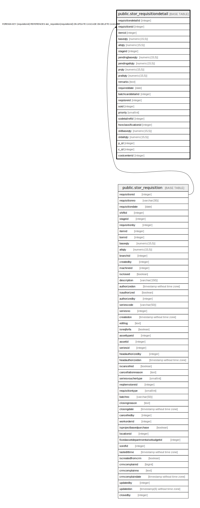

# public.stor_requisitiondetail

## Description

## Columns

| Name | Type | Default | Nullable | Children | Parents | Comment |
| ---- | ---- | ------- | -------- | -------- | ------- | ------- |
| requisitiondetailid | integer | nextval('stor_requisitiondetail_requisitiondetailid_seq'::regclass) | false |  |  |  |
| requisitionid | integer |  | true |  | [public.stor_requisition](public.stor_requisition.md) |  |
| itemid | integer |  | true |  |  |  |
| baseqty | numeric(15,5) |  | true |  |  |  |
| altqty | numeric(15,5) |  | true |  |  |  |
| stageid | integer |  | true |  |  |  |
| pendingbaseqty | numeric(15,5) |  | true |  |  | Used for closing Requisition against fix asset |
| pendingaltqty | numeric(15,5) |  | true |  |  | Used for closing Requisition against fix asset |
| prqty | numeric(15,5) | 0 | true |  |  | used to persist purchase requisition qty if its is against store requisition |
| praltqty | numeric(15,5) | 0 | true |  |  | used to persist purchase requisition qty if its is against store requisition |
| remarks | text |  | true |  |  |  |
| requireddate | date | now() | true |  |  |  |
| batchcarddetailid | integer |  | true |  |  |  |
| reqstoreid | integer |  | true |  |  |  |
| soid | integer |  | true |  |  |  |
| priority | smallint |  | true |  |  |  |
| sodetailrefid | integer |  | true |  |  |  |
| hsnclassificationid | integer |  | true |  |  |  |
| oldbaseqty | numeric(15,5) |  | true |  |  |  |
| oldaltqty | numeric(15,5) |  | true |  |  |  |
| p_id | integer |  | true |  |  |  |
| c_id | integer |  | true |  |  |  |
| costcenterid | integer |  | true |  |  |  |

## Constraints

| Name | Type | Definition |
| ---- | ---- | ---------- |
| stor_storerequisitiondetail_fk | FOREIGN KEY | FOREIGN KEY (requisitionid) REFERENCES stor_requisition(requisitionid) ON UPDATE CASCADE ON DELETE CASCADE |
| stor_storerequisitiondetail_pkey | PRIMARY KEY | PRIMARY KEY (requisitiondetailid) |

## Indexes

| Name | Definition |
| ---- | ---------- |
| stor_storerequisitiondetail_pkey | CREATE UNIQUE INDEX stor_storerequisitiondetail_pkey ON public.stor_requisitiondetail USING btree (requisitiondetailid) |
| Index_SRN_Det_ReqID | CREATE INDEX "Index_SRN_Det_ReqID" ON public.stor_requisitiondetail USING btree (requisitionid) |

## Relations

---

> Generated by [tbls](https://github.com/k1LoW/tbls)
