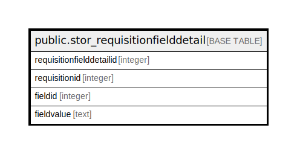

# public.stor_requisitionfielddetail

## Description

## Columns

| Name | Type | Default | Nullable | Children | Parents | Comment |
| ---- | ---- | ------- | -------- | -------- | ------- | ------- |
| requisitionfielddetailid | integer | nextval('stor_requisitionfielddetail_requisitionfielddetailid_seq'::regclass) | false |  |  |  |
| requisitionid | integer |  | true |  |  |  |
| fieldid | integer |  | true |  |  |  |
| fieldvalue | text |  | true |  |  |  |

## Constraints

| Name | Type | Definition |
| ---- | ---- | ---------- |
| stor_requisitionfielddetail_pkey | PRIMARY KEY | PRIMARY KEY (requisitionfielddetailid) |

## Indexes

| Name | Definition |
| ---- | ---------- |
| stor_requisitionfielddetail_pkey | CREATE UNIQUE INDEX stor_requisitionfielddetail_pkey ON public.stor_requisitionfielddetail USING btree (requisitionfielddetailid) |
| Index_SRN_FielDet_ReqID | CREATE INDEX "Index_SRN_FielDet_ReqID" ON public.stor_requisitionfielddetail USING btree (requisitionid) |

## Relations

---

> Generated by [tbls](https://github.com/k1LoW/tbls)
