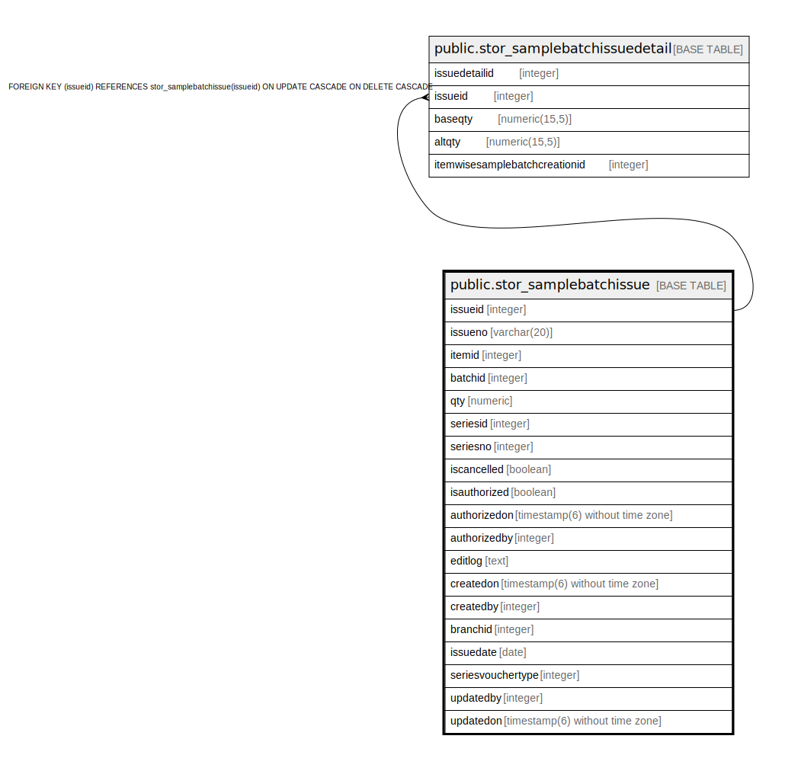

# public.stor_samplebatchissue

## Description

## Columns

| Name | Type | Default | Nullable | Children | Parents | Comment |
| ---- | ---- | ------- | -------- | -------- | ------- | ------- |
| issueid | integer | nextval('stor_samplebatchissue_issueid_seq'::regclass) | false | [public.stor_samplebatchissuedetail](public.stor_samplebatchissuedetail.md) |  |  |
| issueno | varchar(20) |  | false |  |  |  |
| itemid | integer |  | true |  |  |  |
| batchid | integer |  | true |  |  |  |
| qty | numeric |  | true |  |  |  |
| seriesid | integer |  | true |  |  |  |
| seriesno | integer |  | true |  |  |  |
| iscancelled | boolean | false | false |  |  |  |
| isauthorized | boolean | false | false |  |  |  |
| authorizedon | timestamp(6) without time zone |  | true |  |  |  |
| authorizedby | integer |  | true |  |  |  |
| editlog | text |  | true |  |  |  |
| createdon | timestamp(6) without time zone | now() | true |  |  |  |
| createdby | integer |  | true |  |  |  |
| branchid | integer |  | true |  |  |  |
| issuedate | date |  | true |  |  |  |
| seriesvouchertype | integer |  | true |  |  |  |
| updatedby | integer |  | true |  |  |  |
| updatedon | timestamp(6) without time zone | NULL::timestamp without time zone | true |  |  |  |

## Constraints

| Name | Type | Definition |
| ---- | ---- | ---------- |
| stor_samplebatchissue_pkey | PRIMARY KEY | PRIMARY KEY (issueid) |

## Indexes

| Name | Definition |
| ---- | ---------- |
| stor_samplebatchissue_pkey | CREATE UNIQUE INDEX stor_samplebatchissue_pkey ON public.stor_samplebatchissue USING btree (issueid) |

## Relations

---

> Generated by [tbls](https://github.com/k1LoW/tbls)
