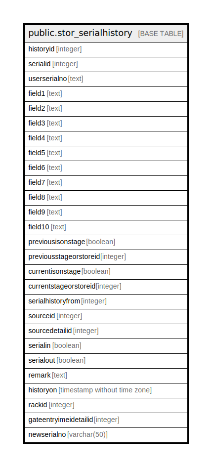

# public.stor_serialhistory

## Description

## Columns

| Name | Type | Default | Nullable | Children | Parents | Comment |
| ---- | ---- | ------- | -------- | -------- | ------- | ------- |
| historyid | integer | nextval('stor_serialhistory_historyid_seq'::regclass) | false |  |  |  |
| serialid | integer |  | true |  |  |  |
| userserialno | text |  | true |  |  |  |
| field1 | text |  | true |  |  |  |
| field2 | text |  | true |  |  |  |
| field3 | text |  | true |  |  |  |
| field4 | text |  | true |  |  |  |
| field5 | text |  | true |  |  |  |
| field6 | text |  | true |  |  |  |
| field7 | text |  | true |  |  |  |
| field8 | text |  | true |  |  |  |
| field9 | text |  | true |  |  |  |
| field10 | text |  | true |  |  |  |
| previousisonstage | boolean |  | true |  |  |  |
| previousstageorstoreid | integer |  | true |  |  |  |
| currentisonstage | boolean |  | true |  |  |  |
| currentstageorstoreid | integer |  | true |  |  |  |
| serialhistoryfrom | integer |  | true |  |  | 1:  Production,  2:  MRN,  3:  Store Opening Stock,  4:  Stage Opening Stock,  5:  Stock Adjustment,  6:  MRN-By Sales Return,  7:  MRN-By RGP Insource,  8:  Batch Card,  9:  Production Consumption,  10: Delivery Note,  11: Physical Stock Verification,  12: Store Issue,  13: Store Issue Return,  14: Stock Transfer,  15: Jobwork Dispatch,  16: Stock Adjustment,  17: Production Journal,  18: Reprocessing,  19: Repacking,  20: Updated by Update Serial Specification 21: Pick List 22: Packing List of Pick List |
| sourceid | integer |  | true |  |  |  |
| sourcedetailid | integer |  | true |  |  |  |
| serialin | boolean | false | true |  |  |  |
| serialout | boolean | false | true |  |  |  |
| remark | text |  | true |  |  |  |
| historyon | timestamp without time zone | now() | true |  |  |  |
| rackid | integer | 0 | false |  |  |  |
| gateentryimeidetailid | integer | 0 | false |  |  |  |
| newserialno | varchar(50) | ''::character varying | true |  |  |  |

## Constraints

| Name | Type | Definition |
| ---- | ---- | ---------- |
| stor_serialhistory_pkey | PRIMARY KEY | PRIMARY KEY (historyid) |

## Indexes

| Name | Definition |
| ---- | ---------- |
| stor_serialhistory_pkey | CREATE UNIQUE INDEX stor_serialhistory_pkey ON public.stor_serialhistory USING btree (historyid) |

## Relations

---

> Generated by [tbls](https://github.com/k1LoW/tbls)
