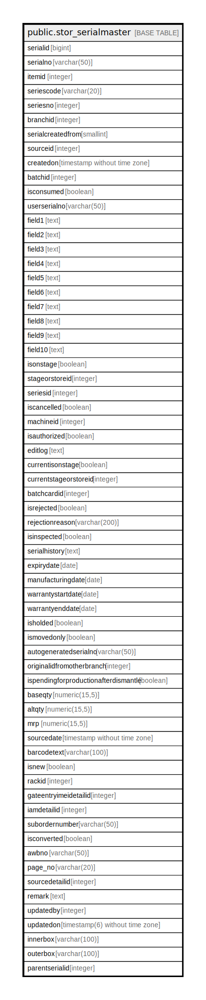

# public.stor_serialmaster

## Description

## Columns

| Name | Type | Default | Nullable | Children | Parents | Comment |
| ---- | ---- | ------- | -------- | -------- | ------- | ------- |
| serialid | bigint | nextval('stor_serialmaster_serialid_seq'::regclass) | false |  |  |  |
| serialno | varchar(50) |  | true |  |  |  |
| itemid | integer |  | true |  |  |  |
| seriescode | varchar(20) |  | true |  |  |  |
| seriesno | integer |  | true |  |  |  |
| branchid | integer |  | true |  |  |  |
| serialcreatedfrom | smallint | 1 | true |  |  | 1: Production 2: IAM(inspectionid) 3: Store Opening Stock 4: Stage Opening Stock 5: Stock Adjustment 6: MRN-By Sales Return 7: MRN-By RGP Insource 8: Batch Card |
| sourceid | integer |  | true |  |  |  |
| createdon | timestamp without time zone | now() | true |  |  |  |
| batchid | integer |  | true |  |  |  |
| isconsumed | boolean | false | true |  |  |  |
| userserialno | varchar(50) |  | true |  |  |  |
| field1 | text |  | true |  |  |  |
| field2 | text |  | true |  |  |  |
| field3 | text |  | true |  |  |  |
| field4 | text |  | true |  |  |  |
| field5 | text |  | true |  |  |  |
| field6 | text |  | true |  |  |  |
| field7 | text |  | true |  |  |  |
| field8 | text |  | true |  |  |  |
| field9 | text |  | true |  |  |  |
| field10 | text |  | true |  |  |  |
| isonstage | boolean | true | true |  |  | True if on stage False if on store |
| stageorstoreid | integer |  | true |  |  |  |
| seriesid | integer |  | true |  |  |  |
| iscancelled | boolean | false | true |  |  |  |
| machineid | integer | 0 | true |  |  | Used to generate machine  serialano |
| isauthorized | boolean | false | true |  |  |  |
| editlog | text |  | true |  |  |  |
| currentisonstage | boolean | true | true |  |  |  |
| currentstageorstoreid | integer | 0 | true |  |  |  |
| batchcardid | integer |  | true |  |  |  |
| isrejected | boolean | false | true |  |  |  |
| rejectionreason | varchar(200) |  | true |  |  |  |
| isinspected | boolean | true | true |  |  |  |
| serialhistory | text |  | true |  |  |  |
| expirydate | date |  | true |  |  |  |
| manufacturingdate | date |  | true |  |  |  |
| warrantystartdate | date |  | true |  |  |  |
| warrantyenddate | date |  | true |  |  |  |
| isholded | boolean | false | true |  |  |  |
| ismovedonly | boolean | false | true |  |  | Moved only for 1 : 1, serial will not count if moved only in production and movement |
| autogeneratedserialno | varchar(50) |  | true |  |  |  |
| originalidfromotherbranch | integer |  | true |  |  |  |
| ispendingforproductionafterdismantle | boolean | false | true |  |  |  |
| baseqty | numeric(15,5) |  | true |  |  |  |
| altqty | numeric(15,5) |  | true |  |  |  |
| mrp | numeric(15,5) |  | true |  |  |  |
| sourcedate | timestamp without time zone |  | true |  |  |  |
| barcodetext | varchar(100) |  | true |  |  |  |
| isnew | boolean | false | true |  |  |  |
| rackid | integer | 0 | true |  |  |  |
| gateentryimeidetailid | integer | 0 | false |  |  |  |
| iamdetailid | integer | 0 | false |  |  |  |
| subordernumber | varchar(50) | ''::character varying | true |  |  |  |
| isconverted | boolean | false | true |  |  |  |
| awbno | varchar(50) |  | true |  |  |  |
| page_no | varchar(20) |  | true |  |  |  |
| sourcedetailid | integer |  | true |  |  | Used to save detailids of master transactions |
| remark | text |  | true |  |  |  |
| updatedby | integer |  | true |  |  |  |
| updatedon | timestamp(6) without time zone | NULL::timestamp without time zone | true |  |  |  |
| innerbox | varchar(100) |  | true |  |  |  |
| outerbox | varchar(100) |  | true |  |  |  |
| parentserialid | integer |  | true |  |  |  |

## Constraints

| Name | Type | Definition |
| ---- | ---- | ---------- |
| stor_serialmaster_pkey | PRIMARY KEY | PRIMARY KEY (serialid) |

## Indexes

| Name | Definition |
| ---- | ---------- |
| stor_serialmaster_pkey | CREATE UNIQUE INDEX stor_serialmaster_pkey ON public.stor_serialmaster USING btree (serialid) |
| Index_SM_SerlCr | CREATE INDEX "Index_SM_SerlCr" ON public.stor_serialmaster USING btree (itemid, batchid, branchid, serialno, iscancelled) WHERE (iscancelled = false) |
| Index_SerialMast_StorIdCons | CREATE INDEX "Index_SerialMast_StorIdCons" ON public.stor_serialmaster USING btree (currentstageorstoreid) WHERE ((currentisonstage = false) AND (isholded = false) AND (isauthorized = true) AND (isinspected = true) AND (iscancelled = false)) |
| s_itemid | CREATE INDEX s_itemid ON public.stor_serialmaster USING btree (itemid) |
| s_serialid | CREATE INDEX s_serialid ON public.stor_serialmaster USING btree (serialid) |
| serialmaster_barcodetext | CREATE INDEX serialmaster_barcodetext ON public.stor_serialmaster USING btree (barcodetext) |
| serialmaster_barcodetext_branch | CREATE INDEX serialmaster_barcodetext_branch ON public.stor_serialmaster USING btree (barcodetext, branchid) |
| serialmaster_stage | CREATE INDEX serialmaster_stage ON public.stor_serialmaster USING btree (serialid, currentisonstage, currentstageorstoreid, isrejected) |

## Triggers

| Name | Definition |
| ---- | ---------- |
| gateentryimeidetailid | CREATE TRIGGER gateentryimeidetailid AFTER INSERT OR UPDATE ON public.stor_serialmaster FOR EACH ROW EXECUTE FUNCTION tgr_cartonstatusingateentryimeidetail() |
| serialhistorydata | CREATE TRIGGER serialhistorydata BEFORE INSERT OR UPDATE ON public.stor_serialmaster FOR EACH ROW EXECUTE FUNCTION tgr_serialhistory() |
| serialhistorylog | CREATE TRIGGER serialhistorylog AFTER UPDATE ON public.stor_serialmaster FOR EACH ROW EXECUTE FUNCTION serialhistorylog() |
| trg_addrandomserial | CREATE TRIGGER trg_addrandomserial BEFORE INSERT ON public.stor_serialmaster FOR EACH ROW EXECUTE FUNCTION trg_fun_addrandomserial() |

## Relations

---

> Generated by [tbls](https://github.com/k1LoW/tbls)
