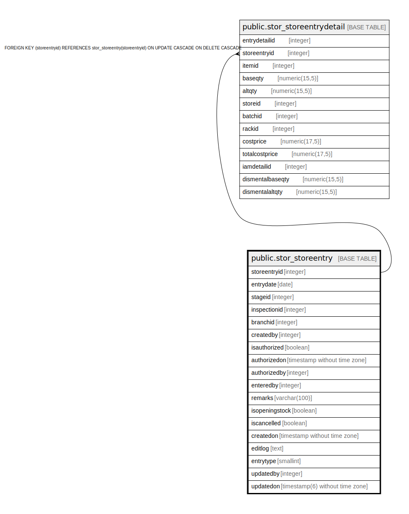

# public.stor_storeentry

## Description

## Columns

| Name | Type | Default | Nullable | Children | Parents | Comment |
| ---- | ---- | ------- | -------- | -------- | ------- | ------- |
| storeentryid | integer | nextval('stor_storeentry_storeentryid_seq'::regclass) | false | [public.stor_storeentrydetail](public.stor_storeentrydetail.md) |  |  |
| entrydate | date |  | true |  |  |  |
| stageid | integer |  | true |  |  |  |
| inspectionid | integer |  | true |  |  |  |
| branchid | integer |  | true |  |  |  |
| createdby | integer |  | true |  |  |  |
| isauthorized | boolean | false | false |  |  |  |
| authorizedon | timestamp without time zone |  | true |  |  |  |
| authorizedby | integer |  | true |  |  |  |
| enteredby | integer |  | true |  |  |  |
| remarks | varchar(100) |  | true |  |  |  |
| isopeningstock | boolean | false | false |  |  |  |
| iscancelled | boolean | false | false |  |  |  |
| createdon | timestamp without time zone | now() | true |  |  |  |
| editlog | text |  | true |  |  |  |
| entrytype | smallint | 1 | true |  |  | 1=openingstock,  2=inspectionaftermrn,  3=production If movetostore after production,  4=inspectionBeforemrn,  5=Rejected Qty from the produced qty during production moved to rejection store,  6=Rejected Qty from the consumed qty during production moved to rejection store,  7= Scrap Qty From Consumed Qty During Production,  8=production If movetostore after obWork/WorkOrder,  9=Rejected Qty from the produced qty during JobWork/WorkOrder moved to rejection store, 10=Rejected Qty From consumed qty during jobwork/WorkOrder,  11= Scrap Qty From Consumed Qty During Jobwork/WorkOrder,  12= Store Entry Against Qlty Inspection(Production), 13= Store Entry From Trading Excise Opening Invoice  |
| updatedby | integer |  | true |  |  |  |
| updatedon | timestamp(6) without time zone | NULL::timestamp without time zone | true |  |  |  |

## Constraints

| Name | Type | Definition |
| ---- | ---- | ---------- |
| stor_storeentry_pkey | PRIMARY KEY | PRIMARY KEY (storeentryid) |

## Indexes

| Name | Definition |
| ---- | ---------- |
| stor_storeentry_pkey | CREATE UNIQUE INDEX stor_storeentry_pkey ON public.stor_storeentry USING btree (storeentryid) |
| s_e_branchid | CREATE INDEX s_e_branchid ON public.stor_storeentry USING btree (branchid) |
| s_e_date | CREATE INDEX s_e_date ON public.stor_storeentry USING btree (storeentryid, entrydate, branchid) |
| s_e_storeentryid | CREATE INDEX s_e_storeentryid ON public.stor_storeentry USING btree (storeentryid) |

## Triggers

| Name | Definition |
| ---- | ---------- |
| tgr_updatecostdate_storeentry | CREATE TRIGGER tgr_updatecostdate_storeentry AFTER INSERT OR UPDATE ON public.stor_storeentry FOR EACH ROW EXECUTE FUNCTION tgr_updatecostdate() |
| trg_update_storeentrystockcheck | CREATE TRIGGER trg_update_storeentrystockcheck BEFORE UPDATE ON public.stor_storeentry FOR EACH ROW EXECUTE FUNCTION trg_update_storeentrystockcheck() |

## Relations

---

> Generated by [tbls](https://github.com/k1LoW/tbls)
