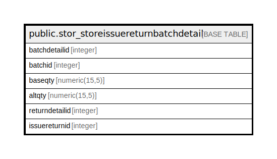

# public.stor_storeissuereturnbatchdetail

## Description

## Columns

| Name | Type | Default | Nullable | Children | Parents | Comment |
| ---- | ---- | ------- | -------- | -------- | ------- | ------- |
| batchdetailid | integer | nextval('stor_storeissuereturnbatchdetail_batchdetailid_seq'::regclass) | false |  |  |  |
| batchid | integer |  | true |  |  |  |
| baseqty | numeric(15,5) |  | true |  |  |  |
| altqty | numeric(15,5) |  | true |  |  |  |
| returndetailid | integer |  | true |  |  |  |
| issuereturnid | integer |  | true |  |  |  |

## Constraints

| Name | Type | Definition |
| ---- | ---- | ---------- |
| stor_storeissuereturnbatchdetail_pkey | PRIMARY KEY | PRIMARY KEY (batchdetailid) |

## Indexes

| Name | Definition |
| ---- | ---------- |
| stor_storeissuereturnbatchdetail_pkey | CREATE UNIQUE INDEX stor_storeissuereturnbatchdetail_pkey ON public.stor_storeissuereturnbatchdetail USING btree (batchdetailid) |

## Relations

---

> Generated by [tbls](https://github.com/k1LoW/tbls)
