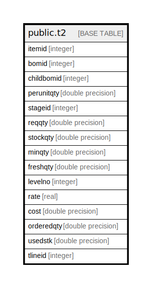

# public.t2

## Description

## Columns

| Name | Type | Default | Nullable | Children | Parents | Comment |
| ---- | ---- | ------- | -------- | -------- | ------- | ------- |
| itemid | integer |  | false |  |  |  |
| bomid | integer |  | true |  |  |  |
| childbomid | integer |  | true |  |  |  |
| perunitqty | double precision |  | true |  |  |  |
| stageid | integer |  | true |  |  |  |
| reqqty | double precision |  | true |  |  |  |
| stockqty | double precision |  | true |  |  |  |
| minqty | double precision |  | true |  |  |  |
| freshqty | double precision |  | true |  |  |  |
| levelno | integer |  | true |  |  |  |
| rate | real |  | true |  |  |  |
| cost | double precision |  | true |  |  |  |
| orderedqty | double precision |  | true |  |  |  |
| usedstk | double precision |  | true |  |  |  |
| tlineid | integer | nextval('t2_tlineid_seq'::regclass) | false |  |  |  |

## Constraints

| Name | Type | Definition |
| ---- | ---- | ---------- |
| t2_pkey | PRIMARY KEY | PRIMARY KEY (tlineid) |

## Indexes

| Name | Definition |
| ---- | ---------- |
| t2_pkey | CREATE UNIQUE INDEX t2_pkey ON public.t2 USING btree (tlineid) |

## Relations

---

> Generated by [tbls](https://github.com/k1LoW/tbls)
