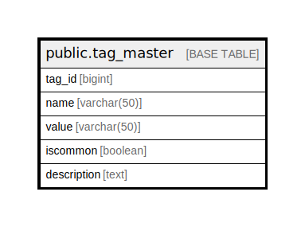

# public.tag_master

## Description

## Columns

| Name | Type | Default | Nullable | Children | Parents | Comment |
| ---- | ---- | ------- | -------- | -------- | ------- | ------- |
| tag_id | bigint | nextval('tag_master_tag_id_seq'::regclass) | false |  |  |  |
| name | varchar(50) |  | true |  |  |  |
| value | varchar(50) |  | true |  |  |  |
| iscommon | boolean |  | true |  |  |  |
| description | text |  | true |  |  |  |

## Constraints

| Name | Type | Definition |
| ---- | ---- | ---------- |
| tag_master_name_key | UNIQUE | UNIQUE (name) |
| tag_master_pkey | PRIMARY KEY | PRIMARY KEY (tag_id) |

## Indexes

| Name | Definition |
| ---- | ---------- |
| tag_master_name_key | CREATE UNIQUE INDEX tag_master_name_key ON public.tag_master USING btree (name) |
| tag_master_pkey | CREATE UNIQUE INDEX tag_master_pkey ON public.tag_master USING btree (tag_id) |

## Relations

---

> Generated by [tbls](https://github.com/k1LoW/tbls)
