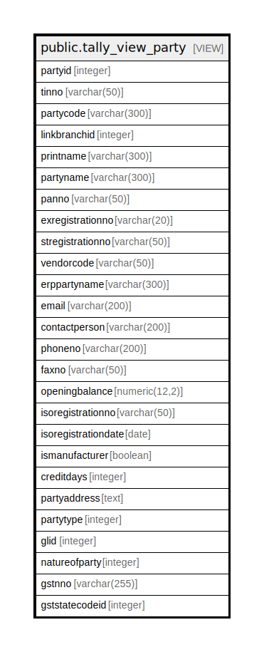

# public.tally_view_party

## Description

<details>
<summary><strong>Table Definition</strong></summary>

```sql
CREATE VIEW tally_view_party AS (
 SELECT pm.partyid,
    pm.tinno,
    pm.partycode,
    pm.linkbranchid,
    pm.partyprintname AS printname,
    pm.partynameintally AS partyname,
    pm.panno,
    pm.exregistrationno,
    pm.stregistrationno,
    pm.vendorcode,
    pm.partyname AS erppartyname,
    pm.email,
    pm.contactperson,
    pm.phoneno,
    pm.faxno,
    pm.openingbalance,
    pm.isoregistrationno,
    pm.isoregistrationdate,
    pm.ismanufacturer,
    pm.creditdays,
    (((COALESCE(((pm.address)::text || chr(13)), ''::text) || COALESCE(((','::text || (cm.cityname)::text) || chr(13)), ''::text)) || COALESCE((','::text || (sm.statename)::text), (''::character varying)::text)) || COALESCE((','::text || (cmm.countryname)::text), (''::character varying)::text)) AS partyaddress,
    pm.partytype,
    pm.glid,
    pm.natureofparty,
    pm.gstnno,
    sm.gststatecodeid
   FROM (((comn_partymaster pm
     LEFT JOIN comn_citymaster cm ON (((pm.cityid = cm.cityid) AND ((cm.cityname)::text <> 'None'::text))))
     LEFT JOIN comn_statemaster sm ON (((pm.stateid = sm.stateid) AND ((sm.statename)::text <> 'None'::text))))
     LEFT JOIN comn_countrymaster cmm ON (((pm.countryid = cmm.countryid) AND ((cmm.countryname)::text <> 'None'::text))))
)
```

</details>

## Columns

| Name | Type | Default | Nullable | Children | Parents | Comment |
| ---- | ---- | ------- | -------- | -------- | ------- | ------- |
| partyid | integer |  | true |  |  |  |
| tinno | varchar(50) |  | true |  |  |  |
| partycode | varchar(300) |  | true |  |  |  |
| linkbranchid | integer |  | true |  |  |  |
| printname | varchar(300) |  | true |  |  |  |
| partyname | varchar(300) |  | true |  |  |  |
| panno | varchar(50) |  | true |  |  |  |
| exregistrationno | varchar(20) |  | true |  |  |  |
| stregistrationno | varchar(50) |  | true |  |  |  |
| vendorcode | varchar(50) |  | true |  |  |  |
| erppartyname | varchar(300) |  | true |  |  |  |
| email | varchar(200) |  | true |  |  |  |
| contactperson | varchar(200) |  | true |  |  |  |
| phoneno | varchar(200) |  | true |  |  |  |
| faxno | varchar(50) |  | true |  |  |  |
| openingbalance | numeric(12,2) |  | true |  |  |  |
| isoregistrationno | varchar(50) |  | true |  |  |  |
| isoregistrationdate | date |  | true |  |  |  |
| ismanufacturer | boolean |  | true |  |  |  |
| creditdays | integer |  | true |  |  |  |
| partyaddress | text |  | true |  |  |  |
| partytype | integer |  | true |  |  |  |
| glid | integer |  | true |  |  |  |
| natureofparty | integer |  | true |  |  |  |
| gstnno | varchar(255) |  | true |  |  |  |
| gststatecodeid | integer |  | true |  |  |  |

## Referenced Tables

| Name | Columns | Comment | Type |
| ---- | ------- | ------- | ---- |
| [public.comn_partymaster](public.comn_partymaster.md) | 120 |  | BASE TABLE |
| [public.comn_citymaster](public.comn_citymaster.md) | 13 |  | BASE TABLE |
| [public.comn_statemaster](public.comn_statemaster.md) | 14 |  | BASE TABLE |
| [public.comn_countrymaster](public.comn_countrymaster.md) | 12 |  | BASE TABLE |

## Relations



---

> Generated by [tbls](https://github.com/k1LoW/tbls)
