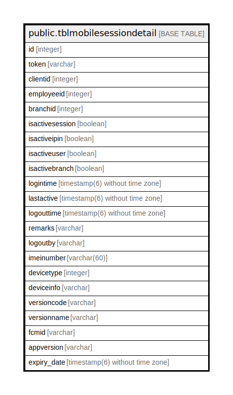

# public.tblmobilesessiondetail

## Description

## Columns

| Name | Type | Default | Nullable | Children | Parents | Comment |
| ---- | ---- | ------- | -------- | -------- | ------- | ------- |
| id | integer | nextval('tblmobilesessiondetail_id_seq'::regclass) | false |  |  |  |
| token | varchar |  | true |  |  |  |
| clientid | integer |  | true |  |  |  |
| employeeid | integer |  | true |  |  |  |
| branchid | integer |  | true |  |  |  |
| isactivesession | boolean | true | true |  |  |  |
| isactiveipin | boolean | true | true |  |  |  |
| isactiveuser | boolean | false | true |  |  |  |
| isactivebranch | boolean | false | true |  |  |  |
| logintime | timestamp(6) without time zone | now() | true |  |  |  |
| lastactive | timestamp(6) without time zone | now() | true |  |  |  |
| logouttime | timestamp(6) without time zone |  | true |  |  |  |
| remarks | varchar |  | true |  |  |  |
| logoutby | varchar |  | true |  |  |  |
| imeinumber | varchar(60) |  | true |  |  |  |
| devicetype | integer |  | true |  |  |  |
| deviceinfo | varchar |  | true |  |  |  |
| versioncode | varchar |  | true |  |  |  |
| versionname | varchar |  | true |  |  |  |
| fcmid | varchar |  | true |  |  |  |
| appversion | varchar |  | true |  |  |  |
| expiry_date | timestamp(6) without time zone |  | true |  |  |  |

## Relations

---

> Generated by [tbls](https://github.com/k1LoW/tbls)
